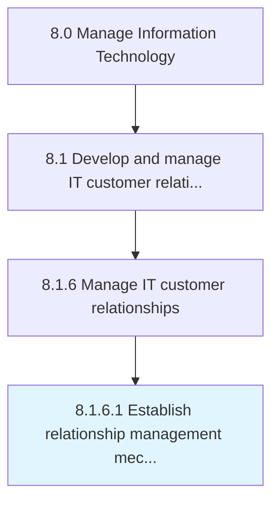

# Establish relationship management mechanisms

> Create mechanisms for effective public relationship in order to preserve the image and goodwill of the organization through the process.

## Overview

Activity 8.1.6.1 is an activity within the Manage Information Technology framework. 

Create mechanisms for effective public relationship in order to preserve the image and goodwill of the organization through the process.

## Process Hierarchy



## Key Statistics

| Metric | Value |
|--------|-------|
| APQC Code | 20642 |
| Hierarchy ID | 8.1.6.1 |
| Level | Activity |
| Parent | [8.1.6](../) |
| Sub-Processes | 0 |


## GraphDL Semantic Structure

```
establish.RelationshipManagementMechanisms
```

| Component | Value | Description |
|-----------|-------|-------------|
| Verb | `establish` | Primary action |
| Object | `relationship management mechanisms` | Direct object |


## Related Concepts

- RelationshipManagementMechanisms


---

*Source: APQC PCF 20642 (8.1.6.1) - APQC*
