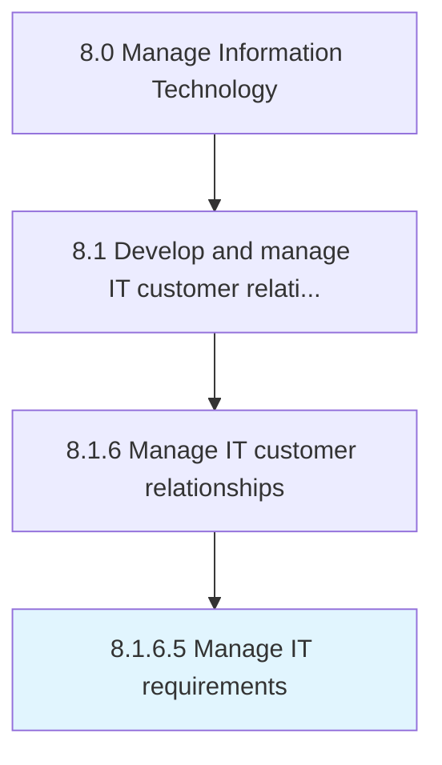

# Manage IT requirements

> Managing the IT requirements for business objectives.

## Overview

Activity 8.1.6.5 is an activity within the Manage Information Technology framework. 

Managing the IT requirements for business objectives. Identify the requirements of hardware and software equipment to store, retrieve, transmit, and manipulate data related to business operations. Consider factors such as functional, design, growth phases, and delivery schedule while managing IT requirements.

## Process Hierarchy



## Key Statistics

| Metric | Value |
|--------|-------|
| APQC Code | 20646 |
| Hierarchy ID | 8.1.6.5 |
| Level | Activity |
| Parent | [8.1.6](../) |
| Sub-Processes | 0 |


## GraphDL Semantic Structure

```
manage.ITRequirements
```

| Component | Value | Description |
|-----------|-------|-------------|
| Verb | `manage` | Primary action |
| Object | `IT requirements` | Direct object |


## Related Concepts

- [ITRequirements](/concepts/ITRequirements)


---

*Source: APQC PCF 20646 (8.1.6.5) - APQC*
