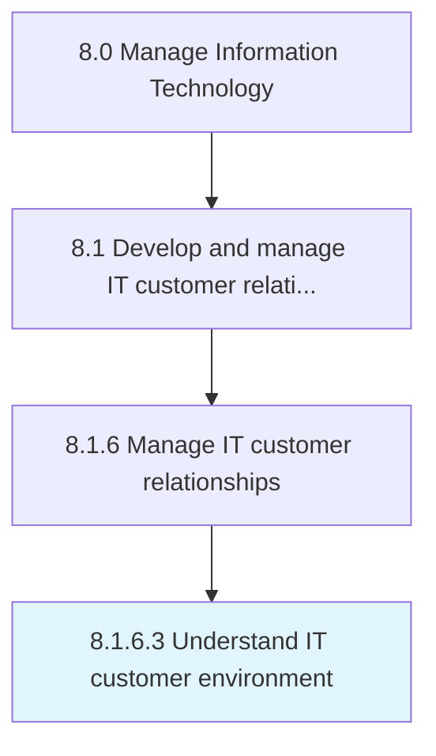

# Understand IT customer environment

> Understanding the environment of staff dependent on information technology.

## Overview

Activity 8.1.6.3 is an activity within the Manage Information Technology framework. 

Understanding the environment of staff dependent on information technology. Assess and evaluate services and solutions used by customers to conduct daily operations, and train new employees.

## Process Hierarchy



## Key Statistics

| Metric | Value |
|--------|-------|
| APQC Code | 20644 |
| Hierarchy ID | 8.1.6.3 |
| Level | Activity |
| Parent | [8.1.6](../) |
| Sub-Processes | 0 |


## GraphDL Semantic Structure

```
understand.ITCustomerEnvironment
```

| Component | Value | Description |
|-----------|-------|-------------|
| Verb | `understand` | Primary action |
| Object | `IT customer environment` | Direct object |


## Related Concepts

- ITCustomerEnvironment


---

*Source: APQC PCF 20644 (8.1.6.3) - APQC*
