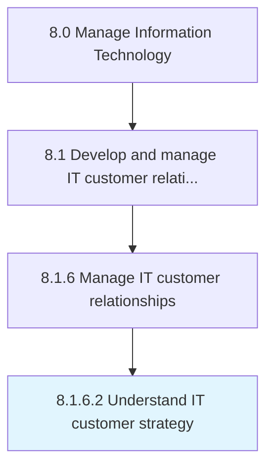

# Understand IT customer strategy

> Understanding the strategy for staff dependent on information technology.

## Overview

Activity 8.1.6.2 is an activity within the Manage Information Technology framework. 

Understanding the strategy for staff dependent on information technology. Create a plan to create services and solutions, conduct daily operations, and train new employees.

## Process Hierarchy



## Key Statistics

| Metric | Value |
|--------|-------|
| APQC Code | 20643 |
| Hierarchy ID | 8.1.6.2 |
| Level | Activity |
| Parent | [8.1.6](../) |
| Sub-Processes | 0 |


## GraphDL Semantic Structure

```
understand.ITCustomerStrategy
```

| Component | Value | Description |
|-----------|-------|-------------|
| Verb | `understand` | Primary action |
| Object | `IT customer strategy` | Direct object |


## Related Concepts

- ITCustomerStrategy


---

*Source: APQC PCF 20643 (8.1.6.2) - APQC*
