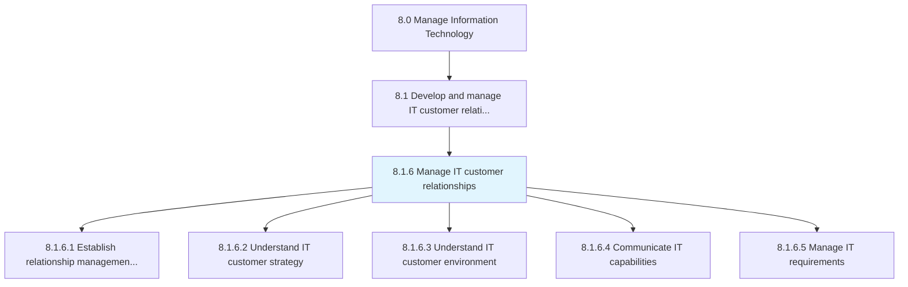
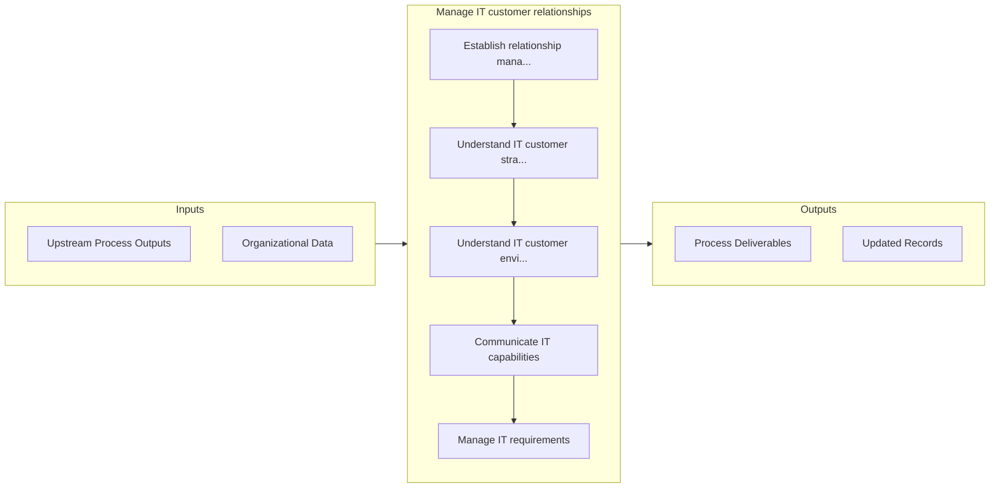

# Manage IT customer relationships

> Managing the IT relationship with its customers by systematically coordinating interactions over multiple touch points on a regular basis.

## Overview

Process 8.1.6 is a core process that defines the specific procedures for manage it customer relationships. 

Managing the IT relationship with its customers by systematically coordinating interactions over multiple touch points on a regular basis. Coordinate the IT's efforts to reach out to its customers, which include emails, social-media interactions, newsletters, and direct conversations.

## Process Hierarchy



## Key Statistics

| Metric | Value |
|--------|-------|
| APQC Code | 20641 |
| Hierarchy ID | 8.1.6 |
| Level | Process |
| Parent | [8.1](../) |
| Sub-Processes | 5 |


## GraphDL Semantic Structure

```
manage.ITCustomerRelationships
```

| Component | Value | Description |
|-----------|-------|-------------|
| Verb | `manage` | Primary action |
| Object | `IT customer relationships` | Direct object |


## Process Flow



## Sub-Processes

| Process | Hierarchy ID | Description |
|---------|-------------|-------------|
| [Establish relationship management mechanisms](./EstablishRelationshipManagementMechanisms) | 8.1.6.1 | Create mechanisms for effective public relationship in order to preserve the image and goodwill of t |
| [Understand IT customer strategy](./UnderstandITCustomerStrategy) | 8.1.6.2 | Understanding the strategy for staff dependent on information technology |
| [Understand IT customer environment](./UnderstandITCustomerEnvironment) | 8.1.6.3 | Understanding the environment of staff dependent on information technology |
| [Communicate IT capabilities](./CommunicateITCapabilities) | 8.1.6.4 | Conveying the goals and objectives of the IT function and how it contributes to the overall business |
| [Manage IT requirements](./ManageITRequirements) | 8.1.6.5 | Managing the IT requirements for business objectives |


## Related Concepts

- [ITCustomerRelationships](/concepts/ITCustomerRelationships)


---

*Source: APQC PCF 20641 (8.1.6) - APQC*
