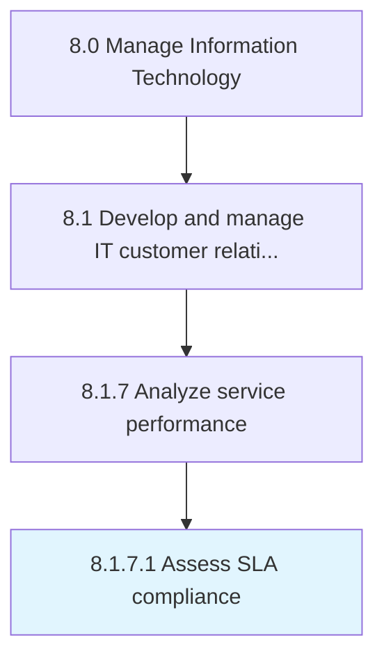

# Assess SLA compliance

> Gather data from each service target defined in an SLA for a time segment or review period to evaluate an overall performance percentage.

## Overview

Activity 8.1.7.1 is an activity within the Manage Information Technology framework. 

Gather data from each service target defined in an SLA for a time segment or review period to evaluate an overall performance percentage.

## Process Hierarchy



## Key Statistics

| Metric | Value |
|--------|-------|
| APQC Code | 20649 |
| Hierarchy ID | 8.1.7.1 |
| Level | Activity |
| Parent | [8.1.7](../) |
| Sub-Processes | 0 |


## GraphDL Semantic Structure

```
assess.SLACompliance
```

| Component | Value | Description |
|-----------|-------|-------------|
| Verb | `assess` | Primary action |
| Object | `SLA compliance` | Direct object |


## Related Concepts

- SLACompliance


---

*Source: APQC PCF 20649 (8.1.7.1) - APQC*
