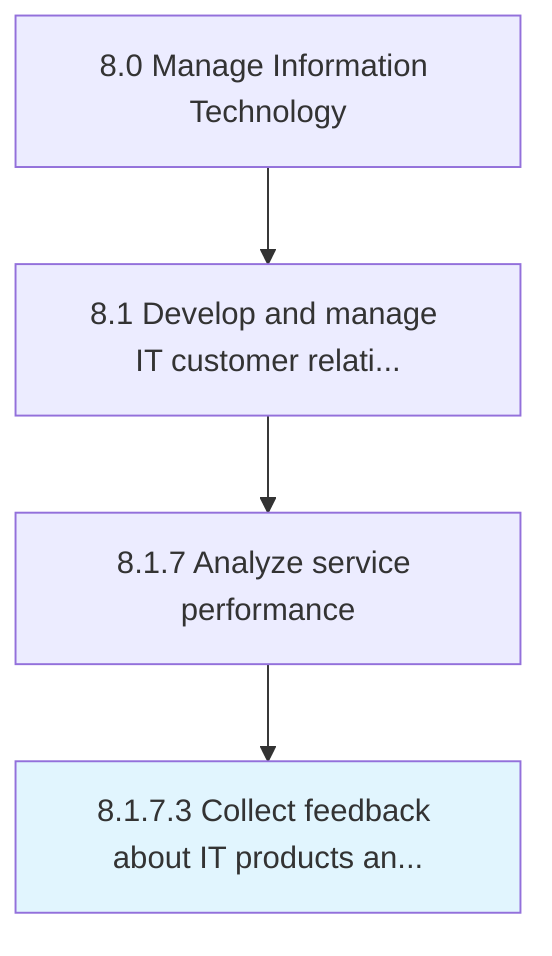

# Collect feedback about IT products and services

> Collecting customer feedback about IT products and services effectiveness based on overall satisfaction.

## Overview

Activity 8.1.7.3 is an activity within the Manage Information Technology framework. 

Collecting customer feedback about IT products and services effectiveness based on overall satisfaction. The data is collected through surveys, customer responses, and feedbacks based on the delivered products/services.

## Process Hierarchy



## Key Statistics

| Metric | Value |
|--------|-------|
| APQC Code | 20647 |
| Hierarchy ID | 8.1.7.3 |
| Level | Activity |
| Parent | [8.1.7](../) |
| Sub-Processes | 0 |


## GraphDL Semantic Structure

```
collect.Feedback.about.ITProductsAndServices
```

| Component | Value | Description |
|-----------|-------|-------------|
| Verb | `collect` | Primary action |
| Object | `feedback` | Direct object |
| Preposition | `about` | Relationship |
| PrepObject | `IT products and services` | Indirect object |


## Related Concepts

- Feedback
- ITProducts
- Services


---

*Source: APQC PCF 20647 (8.1.7.3) - APQC*
