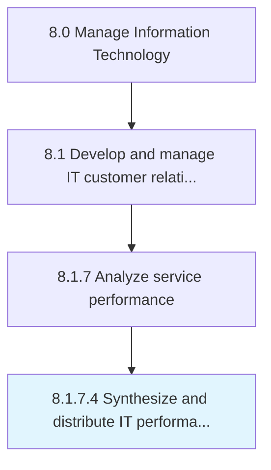

# Synthesize and distribute IT performance information

> Providing stakeholders with collected IT performance measures for further development based on evaluation.

## Overview

Activity 8.1.7.4 is an activity within the Manage Information Technology framework. 

Providing stakeholders with collected IT performance measures for further development based on evaluation.

## Process Hierarchy



## Key Statistics

| Metric | Value |
|--------|-------|
| APQC Code | 20938 |
| Hierarchy ID | 8.1.7.4 |
| Level | Activity |
| Parent | [8.1.7](../) |
| Sub-Processes | 0 |


## GraphDL Semantic Structure

```
synthesize.AndDistributeITPerformanceInformation
```

| Component | Value | Description |
|-----------|-------|-------------|
| Verb | `synthesize` | Primary action |
| Object | `and distribute IT performance information` | Direct object |


## Related Concepts

- [ITPerformanceInformation](/concepts/ITPerformanceInformation)
- [ITPerformanceInformation](/concepts/ITPerformanceInformation)


---

*Source: APQC PCF 20938 (8.1.7.4) - APQC*
