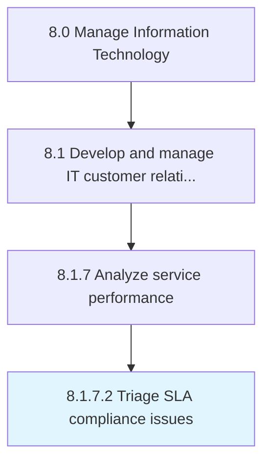

# Triage SLA compliance issues

> Prioritizing SLA compliance issues and plan for remediation.

## Overview

Activity 8.1.7.2 is an activity within the Manage Information Technology framework. 

Prioritizing SLA compliance issues and plan for remediation.

## Process Hierarchy



## Key Statistics

| Metric | Value |
|--------|-------|
| APQC Code | 20650 |
| Hierarchy ID | 8.1.7.2 |
| Level | Activity |
| Parent | [8.1.7](../) |
| Sub-Processes | 0 |


## GraphDL Semantic Structure

```
triage.SLAComplianceIssues
```

| Component | Value | Description |
|-----------|-------|-------------|
| Verb | `triage` | Primary action |
| Object | `SLA compliance issues` | Direct object |


## Related Concepts

- [SLAComplianceIssues](/concepts/SLAComplianceIssues)


---

*Source: APQC PCF 20650 (8.1.7.2) - APQC*
