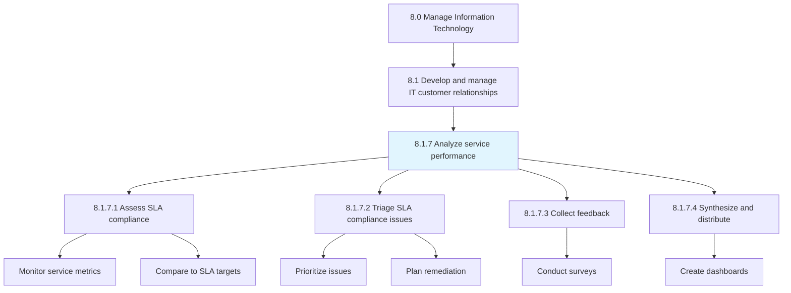
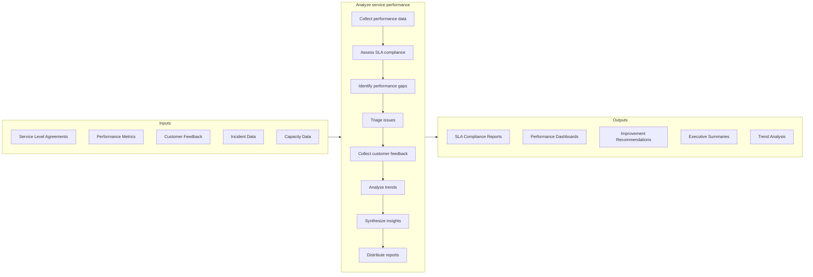
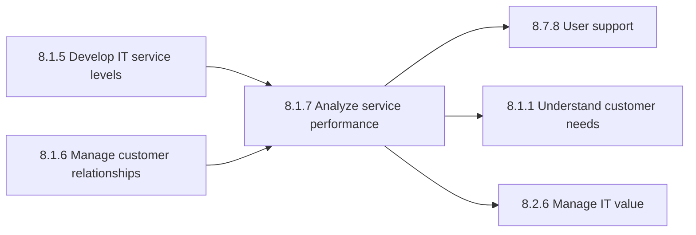

# Analyze service performance

> Proactively manage IT service levels against IT customer requirements.

## Overview

Process 8.1.7 is a core process that defines the specific procedures for analyzing service performance. This process provides continuous visibility into IT service delivery effectiveness and customer satisfaction.

Proactively manage IT service levels against IT customer requirements. This includes monitoring SLA compliance, identifying performance issues, collecting customer feedback, and synthesizing insights for stakeholders and continuous improvement.

Service performance analysis is essential for maintaining customer trust, demonstrating IT value, and driving service improvements. By systematically measuring and analyzing performance data, IT organizations can identify trends, address issues proactively, and continuously enhance service delivery quality.

## Process Hierarchy



## Key Statistics

| Metric | Value |
|--------|-------|
| APQC Code | 20648 |
| Hierarchy ID | 8.1.7 |
| Level | Process |
| Parent | [8.1](../) |
| Sub-Processes | 4 |
| Industry Variants | 19 |

## GraphDL Semantic Structure

```graphdl
analyze.ServicePerformance
assess.SLACompliance
synthesize.PerformanceInformation
```

| Component | Value | Description |
|-----------|-------|-------------|
| Verb | `analyze` | Primary action of examining performance data |
| Object | `service performance` | IT service delivery metrics and outcomes |

## Process Flow



## Child Process Listings

### 8.1.7.1 - Assess SLA compliance

Gather data from each service target defined in an SLA for a time segment or review period to evaluate compliance and identify potential issues.

**Key Activities:**
- Collect service metrics from monitoring systems
- Compare actual performance to SLA targets
- Calculate SLA attainment percentages
- Identify trending issues
- Document compliance status
- Prepare compliance reports

[View Process Details](./AssessSLACompliance)

### 8.1.7.2 - Triage SLA compliance issues

Prioritizing SLA compliance issues and plan for remediation. This sub-process ensures resources focus on highest-impact issues.

**Key Activities:**
- Categorize compliance issues by severity
- Assess business impact of each issue
- Prioritize remediation efforts
- Assign ownership for resolution
- Track remediation progress
- Escalate critical issues

[View Process Details](./TriageSLAComplianceIssues)

### 8.1.7.3 - Collect feedback about IT products and services

Collecting customer feedback about IT products and services effectiveness based on overall satisfaction. This sub-process captures the voice of the customer.

**Key Activities:**
- Design and deploy satisfaction surveys
- Conduct customer interviews
- Monitor feedback channels
- Analyze feedback patterns
- Correlate feedback with service metrics
- Report feedback insights

[View Process Details](./CollectFeedbackAboutITProductsAndServices)

### 8.1.7.4 - Synthesize and distribute IT performance information

Providing stakeholders with collected IT performance measures for further development based on evaluation of IT services and solutions.

**Key Activities:**
- Aggregate performance data
- Create executive dashboards
- Develop trend analysis
- Prepare stakeholder reports
- Conduct performance reviews
- Communicate improvement initiatives

[View Process Details](./SynthesizeAndDistributeITPerformanceInformation)

## RACI Matrix

| Activity | Service Performance Manager | IT Service Manager | Business Relationship Manager | Operations Manager | CIO | Business Stakeholders |
|----------|----------------------------|-------------------|------------------------------|-------------------|-----|----------------------|
| Collect performance data | R | C | I | R | I | I |
| Assess SLA compliance | R | A | C | C | I | I |
| Identify performance gaps | R | A | C | C | I | I |
| Triage issues | R | A | C | R | I | I |
| Collect customer feedback | R | C | A | I | I | R |
| Analyze trends | R | C | C | C | I | I |
| Synthesize insights | R | A | C | C | C | I |
| Distribute reports | R | C | A | I | C | R |

**Legend:** R = Responsible, A = Accountable, C = Consulted, I = Informed

## Metrics and KPIs

| Metric | Description | Target | Frequency |
|--------|-------------|--------|-----------|
| SLA Compliance Rate | Percentage of SLA targets met | >95% | Monthly |
| Customer Satisfaction Score | Average IT customer satisfaction rating | >4.0/5.0 | Quarterly |
| Net Promoter Score | Customer likelihood to recommend IT services | >30 | Quarterly |
| Mean Time to Resolution | Average time to resolve issues | <SLA target | Weekly |
| Service Availability | System uptime percentage | >99.5% | Monthly |
| Report Delivery Timeliness | Percentage of reports delivered on schedule | 100% | Monthly |
| Issue Resolution Rate | Percentage of identified issues resolved | >90% | Monthly |
| Feedback Response Rate | Percentage of surveys completed | >40% | Per survey |
| Performance Trend Direction | Improvement trend over time | Positive | Quarterly |
| Stakeholder Engagement | Attendance at performance reviews | >80% | Per review |

## Related Departments

- [IT Service Management](/departments/IT/ServiceManagement) - Service delivery oversight
- [Business Relationship Management](/departments/IT/BRM) - Customer engagement
- [IT Operations](/departments/IT/Operations) - Operational metrics
- [Quality Assurance](/departments/IT/QA) - Quality measurement
- [Business Analytics](/departments/Analytics) - Reporting and analysis
- [Executive Leadership](/departments/Executive) - Strategic performance review

## Related Occupations

- [Computer and Information Systems Managers](/occupations/Technology/Management/ComputerInformationSystemsManagers) - IT performance oversight
- [Management Analysts](/occupations/Business/Operations/ManagementAnalysts) - Performance analysis
- [Market Research Analysts](/occupations/Business/Marketing/MarketResearchAnalysts) - Customer feedback analysis
- [Operations Research Analysts](/occupations/Math/OperationsResearchAnalysts) - Performance optimization
- [Computer Systems Analysts](/occupations/Technology/Analysis/ComputerSystemsAnalysts) - Systems performance analysis
- [Statisticians](/occupations/Math/Statisticians) - Statistical trend analysis

## Related Concepts

- ServicePerformance
- SLACompliance
- CustomerSatisfaction
- PerformanceAnalytics
- ServiceLevelManagement
- ContinuousImprovement

## Related Processes



---

*Source: APQC PCF 20648 (8.1.7) - APQC*
