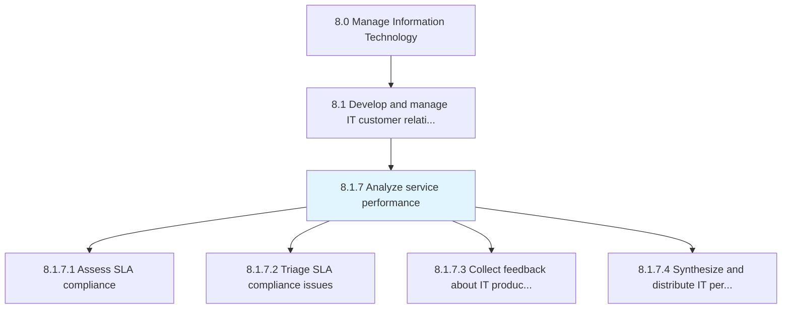
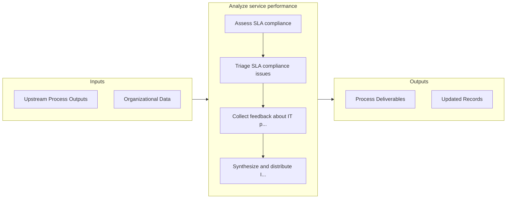

# Analyze service performance

> Proactively manage IT service levels against IT customer requirements.

## Overview

Process 8.1.7 is a core process that defines the specific procedures for analyze service performance. 

Proactively manage IT service levels against IT customer requirements.

## Process Hierarchy



## Key Statistics

| Metric | Value |
|--------|-------|
| APQC Code | 20648 |
| Hierarchy ID | 8.1.7 |
| Level | Process |
| Parent | [8.1](../) |
| Sub-Processes | 4 |


## GraphDL Semantic Structure

```
analyze.ServicePerformance
```

| Component | Value | Description |
|-----------|-------|-------------|
| Verb | `analyze` | Primary action |
| Object | `service performance` | Direct object |


## Process Flow



## Sub-Processes

| Process | Hierarchy ID | Description |
|---------|-------------|-------------|
| [Assess SLA compliance](./AssessSLACompliance) | 8.1.7.1 | Gather data from each service target defined in an SLA for a time segment or review period to evalua |
| [Triage SLA compliance issues](./TriageSLAComplianceIssues) | 8.1.7.2 | Prioritizing SLA compliance issues and plan for remediation |
| [Collect feedback about IT products and services](./CollectFeedbackAboutITProductsAndServices) | 8.1.7.3 | Collecting customer feedback about IT products and services effectiveness based on overall satisfact |
| [Synthesize and distribute IT performance information](./SynthesizeAndDistributeITPerformanceInformation) | 8.1.7.4 | Providing stakeholders with collected IT performance measures for further development based on evalu |


## Related Concepts

- ServicePerformance


---

*Source: APQC PCF 20648 (8.1.7) - APQC*
