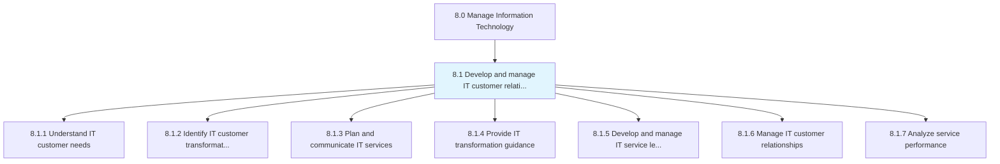
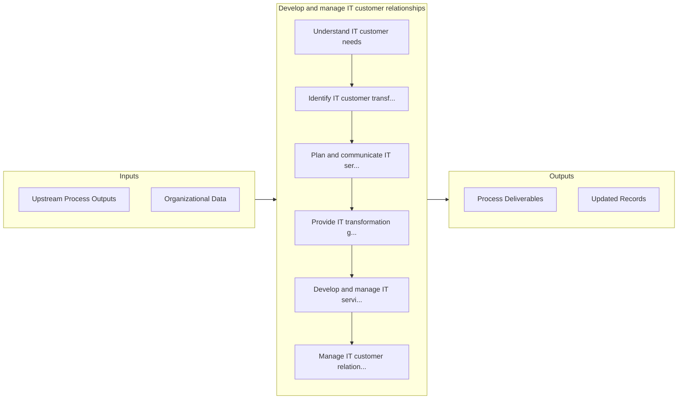

# Develop and manage IT customer relationships

> Creating and administering relationships with IT customers.

## Overview

Group 8.1 is a process group within APQC Category 8.0 (Manage Information Technology). 

Creating and administering relationships with IT customers. Understanding customer needs including high-level business requirements for IT transformation. Plan for and communicate IT services along with establishing IT service levels, providing transformation guidance, and performance analysis that foster IT customer relationships.

## Process Hierarchy



## Key Statistics

| Metric | Value |
|--------|-------|
| APQC Code | 20608 |
| Hierarchy ID | 8.1 |
| Level | Group |
| Parent | [8](../) |
| Sub-Processes | 7 |


## GraphDL Semantic Structure

```
develop.AndManageITCustomerRelationships
```

| Component | Value | Description |
|-----------|-------|-------------|
| Verb | `develop` | Primary action |
| Object | `and manage IT customer relationships` | Direct object |


## Process Flow



## Sub-Processes

| Process | Hierarchy ID | Description |
|---------|-------------|-------------|
| [Understand IT customer needs](./8.1.1-UnderstandITCustomerNeeds/) | 8.1.1 | Assessing the customer communities along with current IT operational capabilities and usage |
| [Identify IT customer transformation needs](./8.1.2-IdentifyITCustomerTransformation/) | 8.1.2 | Identifying changing needs of staff dependent on information technology based on continuous improvem |
| [Plan and communicate IT services](./8.1.3-PlanCommunicateITServices/) | 8.1.3 | Create and design an organized and curated collection of all IT-related services that can be perform |
| [Provide IT transformation guidance](./8.1.4-ProvideITTransformationGuidance/) | 8.1.4 | Understanding the necessity of IT transformation for the business |
| [Develop and manage IT service levels](./8.1.5-DevelopManageITService/) | 8.1.5 | Establishing and maintaining service levels for the provision of IT services and solutions |
| [Manage IT customer relationships](./8.1.6-ManageITCustomerRelationships/) | 8.1.6 | Managing the IT relationship with its customers by systematically coordinating interactions over mul |
| [Analyze service performance](./8.1.7-AnalyzeServicePerformance/) | 8.1.7 | Proactively manage IT service levels against IT customer requirements |


## Related Concepts

- [ITCustomerRelationships](/concepts/ITCustomerRelationships)
- [ITCustomerRelationships](/concepts/ITCustomerRelationships)


---

*Source: APQC PCF 20608 (8.1) - APQC*
