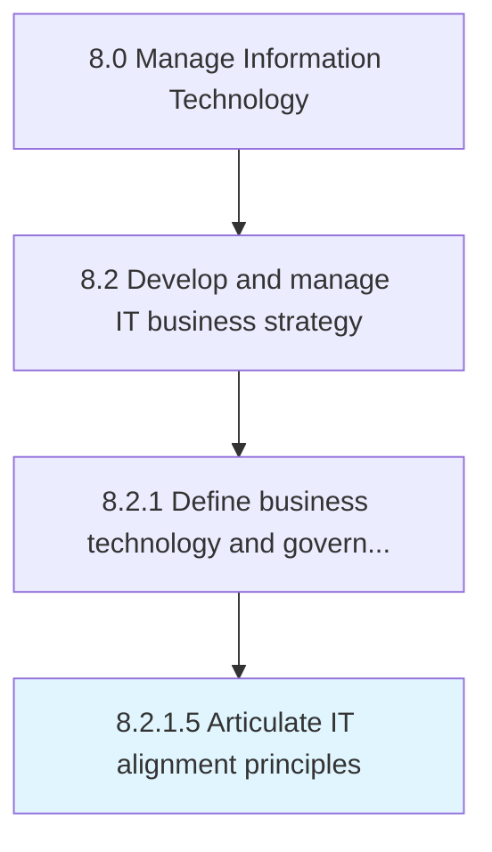

# Articulate IT alignment principles

> Systematic approach to clearly communicate and operate the usage of information technology as it relates to business objectives.

## Overview

Activity 8.2.1.5 is an activity within the Manage Information Technology framework. 

Systematic approach to clearly communicate and operate the usage of information technology as it relates to business objectives.

## Process Hierarchy



## Key Statistics

| Metric | Value |
|--------|-------|
| APQC Code | 20658 |
| Hierarchy ID | 8.2.1.5 |
| Level | Activity |
| Parent | [8.2.1](../) |
| Sub-Processes | 0 |


## GraphDL Semantic Structure

```
articulate.ITAlignmentPrinciples
```

| Component | Value | Description |
|-----------|-------|-------------|
| Verb | `articulate` | Primary action |
| Object | `IT alignment principles` | Direct object |


## Related Concepts

- ITAlignmentPrinciples


---

*Source: APQC PCF 20658 (8.2.1.5) - APQC*
