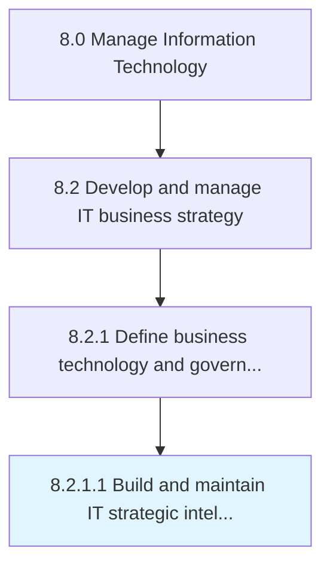

# Build and maintain IT strategic intelligence

> Building and maintaining intelligence towards changing organizational goals, supporting management, and operational or functional levels of the business.

## Overview

Activity 8.2.1.1 is an activity within the Manage Information Technology framework. 

Building and maintaining intelligence towards changing organizational goals, supporting management, and operational or functional levels of the business. It is the ability to understand business trends that present threats or opportunities for IT in an organization.

## Process Hierarchy



## Key Statistics

| Metric | Value |
|--------|-------|
| APQC Code | 20654 |
| Hierarchy ID | 8.2.1.1 |
| Level | Activity |
| Parent | [8.2.1](../) |
| Sub-Processes | 0 |


## GraphDL Semantic Structure

```
build.AndMaintainITStrategicIntelligence
```

| Component | Value | Description |
|-----------|-------|-------------|
| Verb | `build` | Primary action |
| Object | `and maintain IT strategic intelligence` | Direct object |


## Related Concepts

- ITStrategicIntelligence
- ITStrategicIntelligence


---

*Source: APQC PCF 20654 (8.2.1.1) - APQC*
