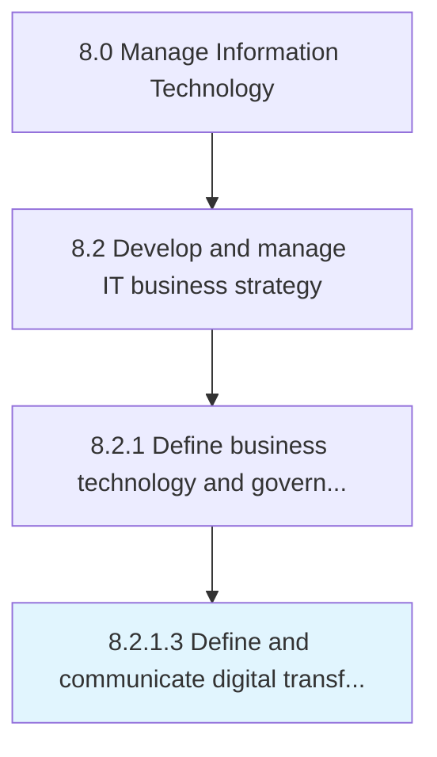

# Define and communicate digital transformation strategy

> Defining the integration of digital technology into business operations and service delivery, and convey the strategy to different segments of business.

## Overview

Activity 8.2.1.3 is an activity within the Manage Information Technology framework. 

Defining the integration of digital technology into business operations and service delivery, and convey the strategy to different segments of business. It is always backed by continuous improvement followed by periodic review and change per requirement of the business.

## Process Hierarchy



## Key Statistics

| Metric | Value |
|--------|-------|
| APQC Code | 20656 |
| Hierarchy ID | 8.2.1.3 |
| Level | Activity |
| Parent | [8.2.1](../) |
| Sub-Processes | 0 |


## GraphDL Semantic Structure

```
define.AndCommunicateDigitalTransformationStrategy
```

| Component | Value | Description |
|-----------|-------|-------------|
| Verb | `define` | Primary action |
| Object | `and communicate digital transformation strategy` | Direct object |


## Related Concepts

- DigitalTransformationStrategy
- DigitalTransformationStrategy


---

*Source: APQC PCF 20656 (8.2.1.3) - APQC*
