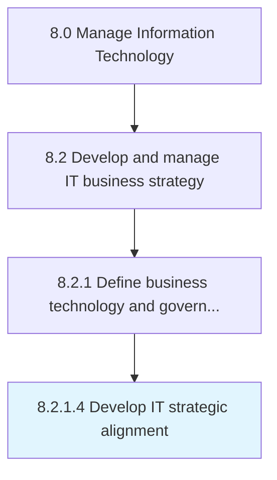

# Develop IT strategic alignment

> Developing the process of aligning the organization's business divisions and staff members with the organization's planned objectives for IT.

## Overview

Activity 8.2.1.4 is an activity within the Manage Information Technology framework. 

Developing the process of aligning the organization's business divisions and staff members with the organization's planned objectives for IT.

## Process Hierarchy



## Key Statistics

| Metric | Value |
|--------|-------|
| APQC Code | 20657 |
| Hierarchy ID | 8.2.1.4 |
| Level | Activity |
| Parent | [8.2.1](../) |
| Sub-Processes | 0 |


## GraphDL Semantic Structure

```
develop.ITStrategicAlignment
```

| Component | Value | Description |
|-----------|-------|-------------|
| Verb | `develop` | Primary action |
| Object | `IT strategic alignment` | Direct object |


## Related Concepts

- ITStrategicAlignment


---

*Source: APQC PCF 20657 (8.2.1.4) - APQC*
