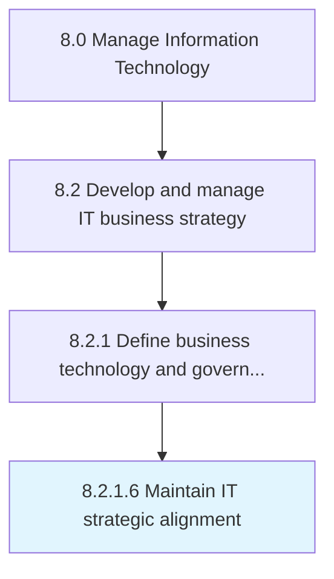

# Maintain IT strategic alignment

> Maintaining alignment of the organization's business divisions and staff members with the organization's planned objectives for IT.

## Overview

Activity 8.2.1.6 is an activity within the Manage Information Technology framework. 

Maintaining alignment of the organization's business divisions and staff members with the organization's planned objectives for IT.

## Process Hierarchy



## Key Statistics

| Metric | Value |
|--------|-------|
| APQC Code | 20659 |
| Hierarchy ID | 8.2.1.6 |
| Level | Activity |
| Parent | [8.2.1](../) |
| Sub-Processes | 0 |


## GraphDL Semantic Structure

```
maintain.ITStrategicAlignment
```

| Component | Value | Description |
|-----------|-------|-------------|
| Verb | `maintain` | Primary action |
| Object | `IT strategic alignment` | Direct object |


## Related Concepts

- ITStrategicAlignment


---

*Source: APQC PCF 20659 (8.2.1.6) - APQC*
