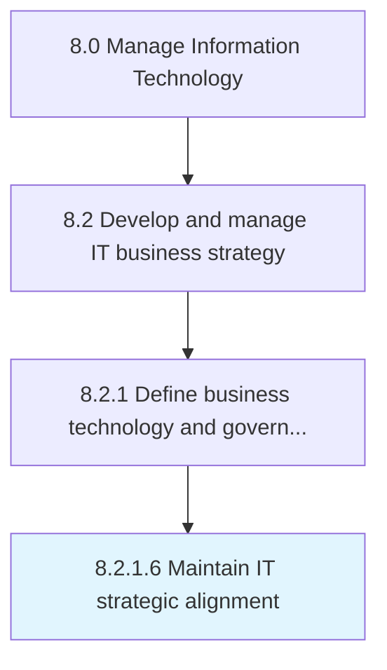
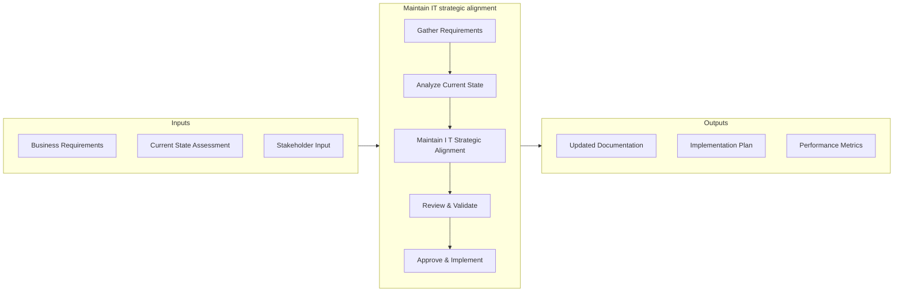
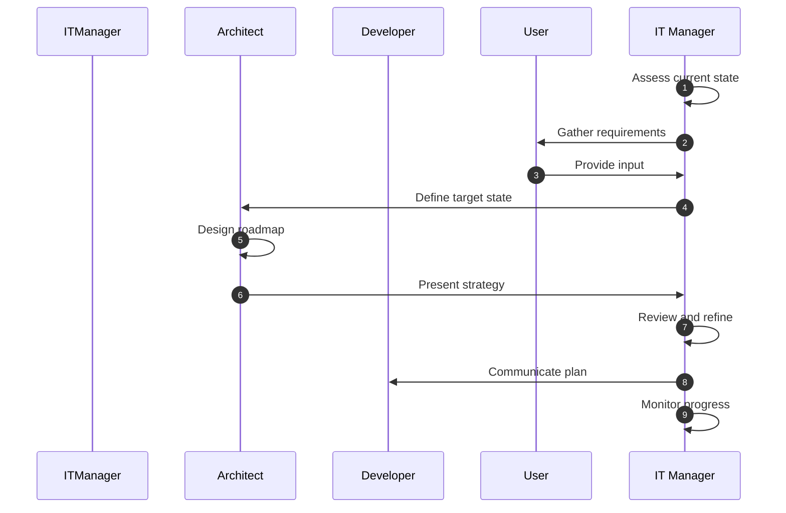

# Maintain IT strategic alignment

> Maintaining alignment of the organization's business divisions and staff members with the organization's planned objectives for IT.

## Overview

Activity 8.2.1.6 focuses on the process of maintain it strategic alignment within the Manage Information Technology framework. This activity is critical for ensuring that IT operations align with organizational objectives and deliver measurable value. Maintaining alignment of the organization's business divisions and staff members with the organization's planned objectives for IT. The process involves systematic planning, execution, and monitoring to ensure consistent quality outcomes. Effective implementation requires cross-functional collaboration between IT teams and business stakeholders, with clear governance structures and defined success criteria. Organizations that excel at this process typically demonstrate stronger IT-business alignment, reduced operational risks, and improved service delivery performance.

## Process Hierarchy



## Key Statistics

| Metric | Value |
|--------|-------|
| APQC Code | 20659 |
| Hierarchy ID | 8.2.1.6 |
| Level | Activity |
| Parent | [8.2.1](../) |
| Sub-Processes | 0 |

## Process Flow



## Process Sequence



## GraphDL Semantic Structure

```graphdl
maintain.ITStrategicAlignment
```

| Component | Value | Description |
|-----------|-------|-------------|
| Verb | `maintain` | Primary action |
| Object | `IT strategic alignment` | Direct object |

## Related Concepts

- ITStrategicAlignment

## RACI Matrix

| Activity | Responsible | Accountable | Consulted | Informed |
|----------|-------------|-------------|-----------|----------|
| Maintain IT strategic alignment | IT Strategic Planner | CIO | Enterprise Architect | Department Heads |
| Review & Approve | IT Director | CIO | Compliance Officer | Executive Team |
| Document & Report | IT Analyst | IT Manager | Quality Assurance | Stakeholders |

## Related Occupations

- [Chief Information Officer (CIO)](/occupations/ChiefInformationOfficers) - Defines IT strategic direction
- [Enterprise Architect](/occupations/SoftwareArchitects) - Designs technology architecture roadmap
- [IT Strategic Planner](/occupations/Business/Operations/ManagementAnalysts) - Develops IT strategic plans and frameworks
- [IT Governance Analyst](/occupations/Management/ComputerAndInformationSystemsManagers) - Ensures alignment of IT with business goals

## Related Departments

- IT Governance - Drives strategic planning and oversight
- Enterprise Architecture - Defines technology roadmaps
- Executive Leadership - Approves strategic direction

## Industry Variations

### Financial Services

In banking and insurance, this process emphasizes regulatory compliance, data privacy requirements, and integration with legacy core systems. Activities include SOX compliance checks, PCI-DSS adherence, and alignment with financial regulatory frameworks.

**Industry-Specific Considerations:**
- Regulatory audit trail requirements
- Data encryption and privacy mandates
- Integration with core banking/insurance platforms

### Healthcare

Healthcare organizations adapt this process to meet HIPAA requirements, electronic health record (EHR) system demands, and clinical workflow integration. Patient data security and interoperability standards (HL7/FHIR) are central concerns.

**Industry-Specific Considerations:**
- HIPAA compliance and patient data protection
- EHR system integration requirements
- Clinical workflow optimization

### Technology / Software

Technology companies typically execute this process with agile methodologies, continuous delivery pipelines, and cloud-native architectures. Emphasis is on rapid iteration, DevOps practices, and scalable infrastructure.

**Industry-Specific Considerations:**
- Agile and DevOps integration
- Cloud-first architecture patterns
- Continuous integration/continuous deployment (CI/CD)

## KPIs & Metrics

| Metric | Description | Target |
|--------|-------------|--------|
| Process Cycle Time | Average time to complete the maintain process end-to-end | < 5 business days |
| Stakeholder Satisfaction | Satisfaction score from internal stakeholders | > 4.0 / 5.0 |
| Compliance Rate | Percentage of activities meeting policy requirements | > 95% |
| Cost Efficiency | Cost per process execution relative to budget | Within 10% of budget |
| First-Time Quality Rate | Percentage of deliverables accepted without rework | > 90% |

---

*Source: APQC PCF 20659 (8.2.1.6) - APQC*
