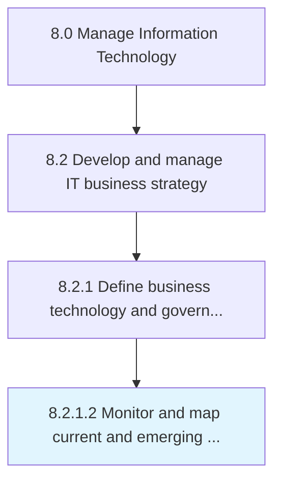

# Monitor and map current and emerging technologies

> Monitoring and evaluating existing and forthcoming technologies to meet the current and future growth plans for business operations.

## Overview

Activity 8.2.1.2 is an activity within the Manage Information Technology framework. 

Monitoring and evaluating existing and forthcoming technologies to meet the current and future growth plans for business operations.

## Process Hierarchy



## Key Statistics

| Metric | Value |
|--------|-------|
| APQC Code | 20655 |
| Hierarchy ID | 8.2.1.2 |
| Level | Activity |
| Parent | [8.2.1](../) |
| Sub-Processes | 0 |


## GraphDL Semantic Structure

```
monitor.AndMapCurrentAndEmergingTechnologies
```

| Component | Value | Description |
|-----------|-------|-------------|
| Verb | `monitor` | Primary action |
| Object | `and map current and emerging technologies` | Direct object |


## Related Concepts

- CurrentTechnologies
- EmergingTechnologies
- CurrentTechnologies
- EmergingTechnologies


---

*Source: APQC PCF 20655 (8.2.1.2) - APQC*
