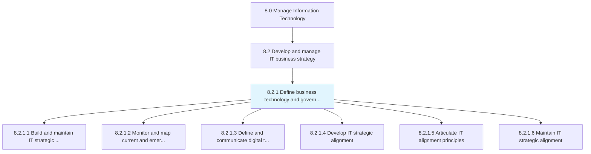
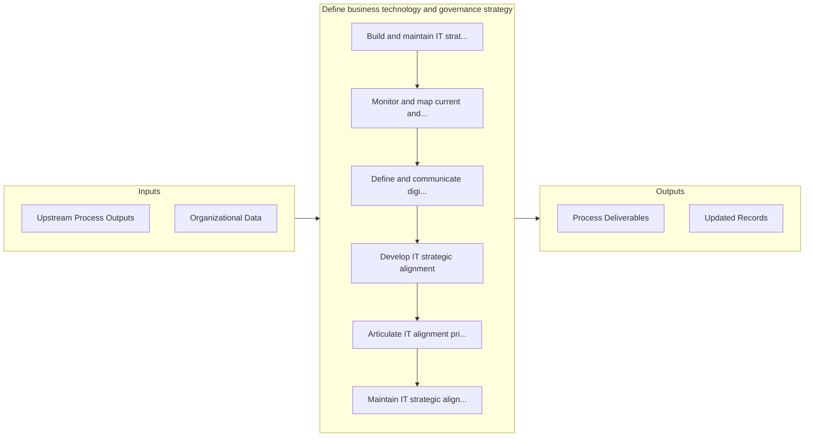

# Define business technology and governance strategy

> Defining the need of technology in business and systematic implementation of IT investments.

## Overview

Process 8.2.1 is a core process that defines the specific procedures for define business technology and governance strategy. 

Defining the need of technology in business and systematic implementation of IT investments. It comprises of assessing competitive technology components to ensure structural analysis, development, usage and security of technology for efficient business operations.

## Process Hierarchy



## Key Statistics

| Metric | Value |
|--------|-------|
| APQC Code | 20653 |
| Hierarchy ID | 8.2.1 |
| Level | Process |
| Parent | [8.2](../) |
| Sub-Processes | 6 |


## GraphDL Semantic Structure

```
define.BusinessTechnologyAndGovernanceStrategy
```

| Component | Value | Description |
|-----------|-------|-------------|
| Verb | `define` | Primary action |
| Object | `business technology and governance strategy` | Direct object |


## Process Flow



## Sub-Processes

| Process | Hierarchy ID | Description |
|---------|-------------|-------------|
| [Build and maintain IT strategic intelligence](./BuildAndMaintainITStrategicIntelligence) | 8.2.1.1 | Building and maintaining intelligence towards changing organizational goals, supporting management,  |
| [Monitor and map current and emerging technologies](./MonitorAndMapCurrentAndEmergingTechnologies) | 8.2.1.2 | Monitoring and evaluating existing and forthcoming technologies to meet the current and future growt |
| [Define and communicate digital transformation strategy](./DefineAndCommunicateDigitalTransformationStrategy) | 8.2.1.3 | Defining the integration of digital technology into business operations and service delivery, and co |
| [Develop IT strategic alignment](./DevelopITStrategicAlignment) | 8.2.1.4 | Developing the process of aligning the organization's business divisions and staff members with the  |
| [Articulate IT alignment principles](./ArticulateITAlignmentPrinciples) | 8.2.1.5 | Systematic approach to clearly communicate and operate the usage of information technology as it rel |
| [Maintain IT strategic alignment](./MaintainITStrategicAlignment) | 8.2.1.6 | Maintaining alignment of the organization's business divisions and staff members with the organizati |


## Related Concepts

- [BusinessTechnologyStrategy](/concepts/BusinessTechnologyStrategy)
- [GovernanceStrategy](/concepts/GovernanceStrategy)


---

*Source: APQC PCF 20653 (8.2.1) - APQC*
