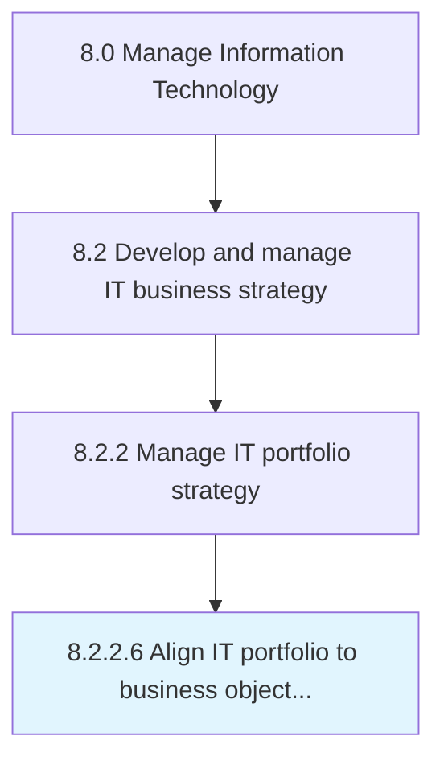

# Align IT portfolio to business objectives

> Aligning IT investments, projects, and activities to achieve overall business objectives.

## Overview

Activity 8.2.2.6 is an activity within the Manage Information Technology framework. 

Aligning IT investments, projects, and activities to achieve overall business objectives.

## Process Hierarchy



## Key Statistics

| Metric | Value |
|--------|-------|
| APQC Code | 20667 |
| Hierarchy ID | 8.2.2.6 |
| Level | Activity |
| Parent | [8.2.2](../) |
| Sub-Processes | 0 |


## GraphDL Semantic Structure

```
align.ITPortfolio.to.BusinessObjectives
```

| Component | Value | Description |
|-----------|-------|-------------|
| Verb | `align` | Primary action |
| Object | `IT portfolio` | Direct object |
| Preposition | `to` | Relationship |
| PrepObject | `business objectives` | Indirect object |


## Related Concepts

- ITPortfolio
- BusinessObjectives


---

*Source: APQC PCF 20667 (8.2.2.6) - APQC*
