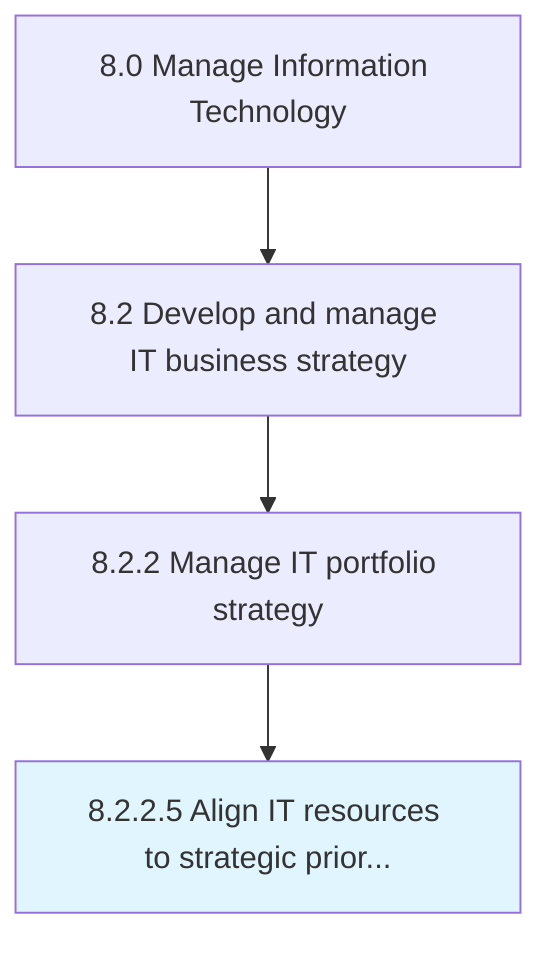

# Align IT resources to strategic priorities

> Aligning physical IT resources like software, IT infrastructure, networks, and non-physical resources like technology expertise, to strategic objectives ranked by their importance in achieving the strategic goals.

## Overview

Activity 8.2.2.5 is an activity within the Manage Information Technology framework. 

Aligning physical IT resources like software, IT infrastructure, networks, and non-physical resources like technology expertise, to strategic objectives ranked by their importance in achieving the strategic goals.

## Process Hierarchy



## Key Statistics

| Metric | Value |
|--------|-------|
| APQC Code | 20665 |
| Hierarchy ID | 8.2.2.5 |
| Level | Activity |
| Parent | [8.2.2](../) |
| Sub-Processes | 0 |


## GraphDL Semantic Structure

```
align.ITResources.to.StrategicPriorities
```

| Component | Value | Description |
|-----------|-------|-------------|
| Verb | `align` | Primary action |
| Object | `IT resources` | Direct object |
| Preposition | `to` | Relationship |
| PrepObject | `strategic priorities` | Indirect object |


## Related Concepts

- [ITResources](/concepts/ITResources)
- [StrategicPriorities](/concepts/StrategicPriorities)


---

*Source: APQC PCF 20665 (8.2.2.5) - APQC*
