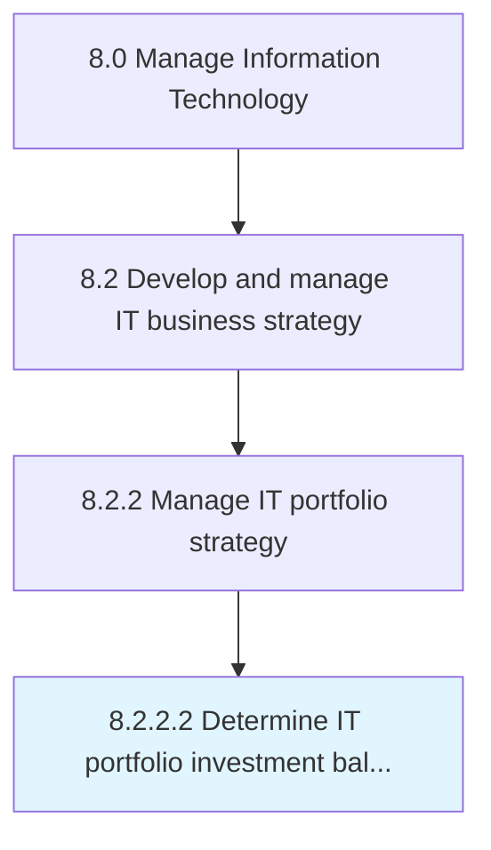

# Determine IT portfolio investment balance

> Determining the uninvested amount out of the total approved amount for overall IT management, IT investments, projects, and activities.

## Overview

Activity 8.2.2.2 is an activity within the Manage Information Technology framework. 

Determining the uninvested amount out of the total approved amount for overall IT management, IT investments, projects, and activities.

## Process Hierarchy



## Key Statistics

| Metric | Value |
|--------|-------|
| APQC Code | 20662 |
| Hierarchy ID | 8.2.2.2 |
| Level | Activity |
| Parent | [8.2.2](../) |
| Sub-Processes | 0 |


## GraphDL Semantic Structure

```
determine.ITPortfolioInvestmentBalance
```

| Component | Value | Description |
|-----------|-------|-------------|
| Verb | `determine` | Primary action |
| Object | `IT portfolio investment balance` | Direct object |


## Related Concepts

- [ITPortfolioInvestmentBalance](/concepts/ITPortfolioInvestmentBalance)


---

*Source: APQC PCF 20662 (8.2.2.2) - APQC*
