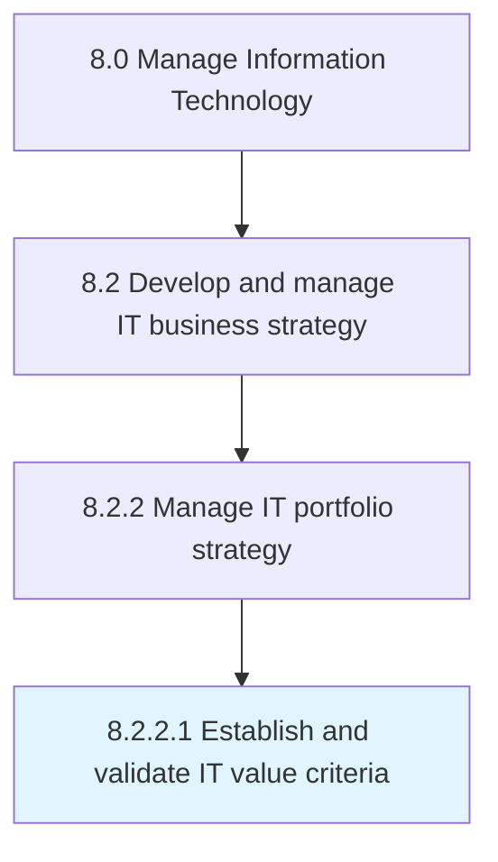

# Establish and validate IT value criteria

> Create and certify the standards to determine the value of the investments, projects, and activities of IT function for the overall business objectives.

## Overview

Activity 8.2.2.1 is an activity within the Manage Information Technology framework. 

Create and certify the standards to determine the value of the investments, projects, and activities of IT function for the overall business objectives.

## Process Hierarchy



## Key Statistics

| Metric | Value |
|--------|-------|
| APQC Code | 20661 |
| Hierarchy ID | 8.2.2.1 |
| Level | Activity |
| Parent | [8.2.2](../) |
| Sub-Processes | 0 |


## GraphDL Semantic Structure

```
establish.AndValidateITValueCriteria
```

| Component | Value | Description |
|-----------|-------|-------------|
| Verb | `establish` | Primary action |
| Object | `and validate IT value criteria` | Direct object |


## Related Concepts

- ITValueCriteria
- ITValueCriteria


---

*Source: APQC PCF 20661 (8.2.2.1) - APQC*
