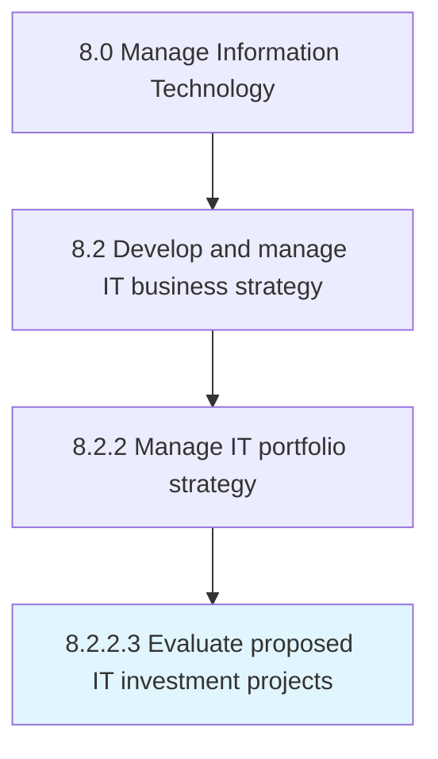

# Evaluate proposed IT investment projects

> Evaluating IT investment projects to achieve overall business objectives in regard to implementation, efficiency, and profitability.

## Overview

Activity 8.2.2.3 is an activity within the Manage Information Technology framework. 

Evaluating IT investment projects to achieve overall business objectives in regard to implementation, efficiency, and profitability.

## Process Hierarchy



## Key Statistics

| Metric | Value |
|--------|-------|
| APQC Code | 20663 |
| Hierarchy ID | 8.2.2.3 |
| Level | Activity |
| Parent | [8.2.2](../) |
| Sub-Processes | 0 |


## GraphDL Semantic Structure

```
evaluate.ProposedITInvestmentProjects
```

| Component | Value | Description |
|-----------|-------|-------------|
| Verb | `evaluate` | Primary action |
| Object | `proposed IT investment projects` | Direct object |


## Related Concepts

- ProposedITInvestmentProjects


---

*Source: APQC PCF 20663 (8.2.2.3) - APQC*
