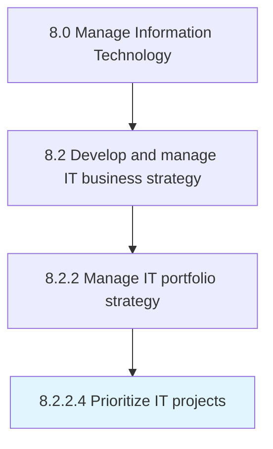

# Prioritize IT projects

> Listing the IT projects in the order of most important to the least.

## Overview

Activity 8.2.2.4 is an activity within the Manage Information Technology framework. 

Listing the IT projects in the order of most important to the least. Determining which of many IT projects are most important or critical to business operations.

## Process Hierarchy



## Key Statistics

| Metric | Value |
|--------|-------|
| APQC Code | 20664 |
| Hierarchy ID | 8.2.2.4 |
| Level | Activity |
| Parent | [8.2.2](../) |
| Sub-Processes | 0 |


## GraphDL Semantic Structure

```
prioritize.ITProjects
```

| Component | Value | Description |
|-----------|-------|-------------|
| Verb | `prioritize` | Primary action |
| Object | `IT projects` | Direct object |


## Related Concepts

- [ITProjects](/concepts/ITProjects)


---

*Source: APQC PCF 20664 (8.2.2.4) - APQC*
