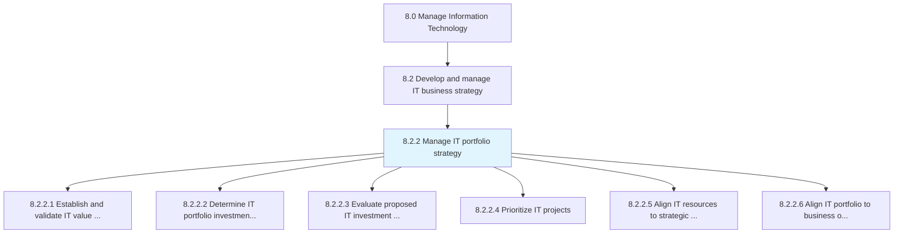
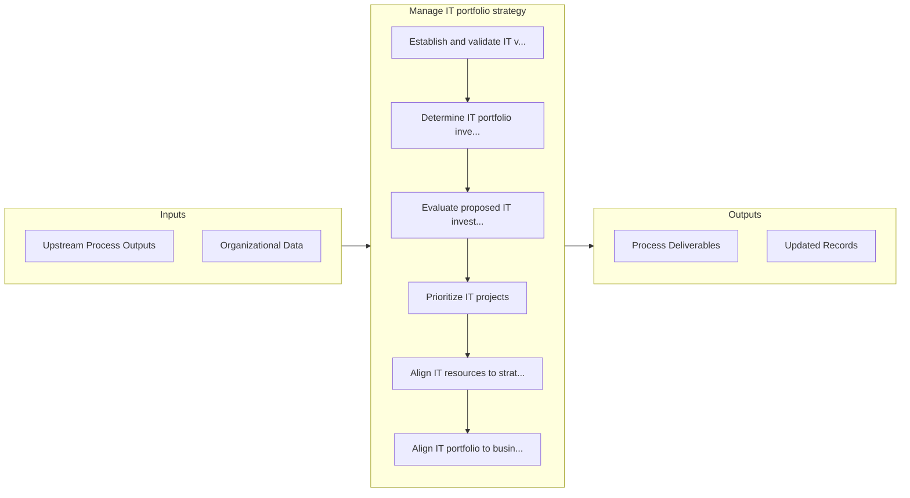

# Manage IT portfolio strategy

> Strategy for systematic management of IT investments, projects, and activities.

## Overview

Process 8.2.2 is a core process that defines the specific procedures for manage it portfolio strategy. 

Strategy for systematic management of IT investments, projects, and activities. Analyze and examine the value of the IT portfolio and allocate resources based on business objectives.

## Process Hierarchy



## Key Statistics

| Metric | Value |
|--------|-------|
| APQC Code | 20660 |
| Hierarchy ID | 8.2.2 |
| Level | Process |
| Parent | [8.2](../) |
| Sub-Processes | 6 |


## GraphDL Semantic Structure

```graphdl
manage.ITPortfolioStrategy
```

| Component | Value | Description |
|-----------|-------|-------------|
| Verb | `manage` | Primary action |
| Object | `IT portfolio strategy` | Direct object |


## Process Flow



## Sub-Processes

| Process | Hierarchy ID | Description |
|---------|-------------|-------------|
| [Establish and validate IT value criteria](./EstablishAndValidateITValueCriteria) | 8.2.2.1 | Create and certify the standards to determine the value of the investments, projects, and activities |
| [Determine IT portfolio investment balance](./DetermineITPortfolioInvestmentBalance) | 8.2.2.2 | Determining the uninvested amount out of the total approved amount for overall IT management, IT inv |
| [Evaluate proposed IT investment projects](./EvaluateProposedITInvestmentProjects) | 8.2.2.3 | Evaluating IT investment projects to achieve overall business objectives in regard to implementation |
| [Prioritize IT projects](./PrioritizeITProjects) | 8.2.2.4 | Listing the IT projects in the order of most important to the least |
| [Align IT resources to strategic priorities](./AlignITResourcesToStrategicPriorities) | 8.2.2.5 | Aligning physical IT resources like software, IT infrastructure, networks, and non-physical resource |
| [Align IT portfolio to business objectives](./AlignITPortfolioToBusinessObjectives) | 8.2.2.6 | Aligning IT investments, projects, and activities to achieve overall business objectives |


## Related Concepts

- ITPortfolioStrategy


---

*Source: APQC PCF 20660 (8.2.2) - APQC*
