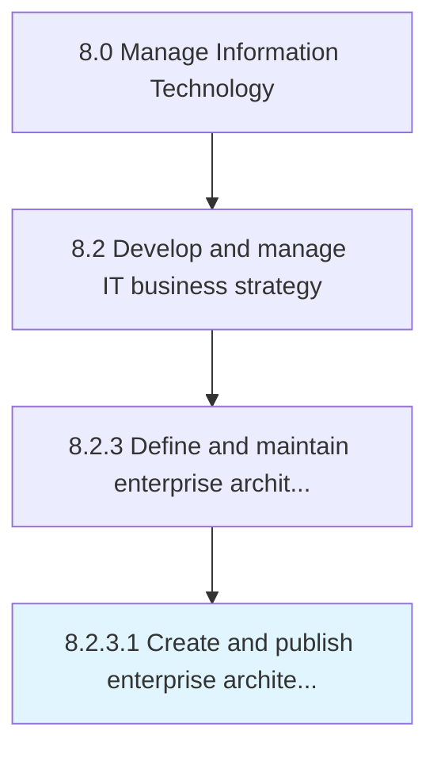

# Create and publish enterprise architecture principles

> Creating and publishing high level statements of the fundamental values (principles) based on the organization's objectives that guide Information Technology decision-making and activities, and are the foundation for enterprise architecture.

## Overview

Activity 8.2.3.1 is an activity within the Manage Information Technology framework. 

Creating and publishing high level statements of the fundamental values (principles) based on the organization's objectives that guide Information Technology decision-making and activities, and are the foundation for enterprise architecture.

## Process Hierarchy



## Key Statistics

| Metric | Value |
|--------|-------|
| APQC Code | 20670 |
| Hierarchy ID | 8.2.3.1 |
| Level | Activity |
| Parent | [8.2.3](../) |
| Sub-Processes | 0 |


## GraphDL Semantic Structure

```
create.AndPublishEnterpriseArchitecturePrinciples
```

| Component | Value | Description |
|-----------|-------|-------------|
| Verb | `create` | Primary action |
| Object | `and publish enterprise architecture principles` | Direct object |


## Related Concepts

- EnterpriseArchitecturePrinciples
- EnterpriseArchitecturePrinciples


---

*Source: APQC PCF 20670 (8.2.3.1) - APQC*
