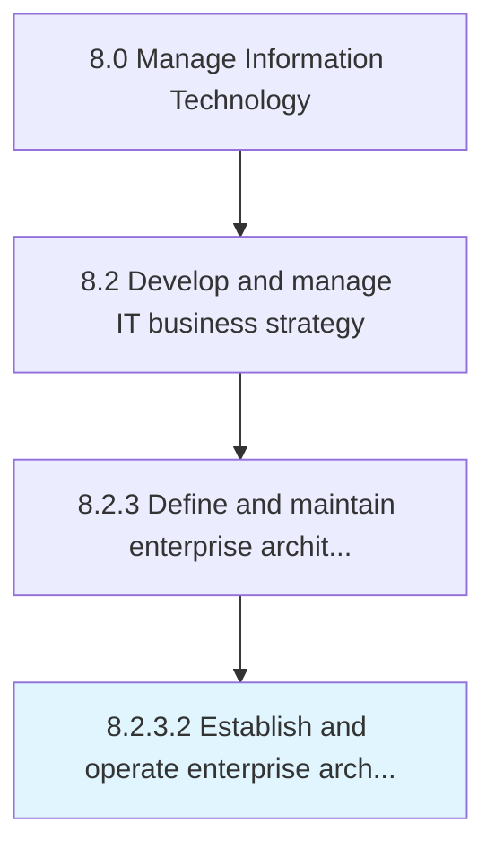

# Establish and operate enterprise architecture governance

> Establishing and operating a structure by which an enterprise defines appropriate strategies and ensures development alignment with those strategies.

## Overview

Activity 8.2.3.2 is an activity within the Manage Information Technology framework. 

Establishing and operating a structure by which an enterprise defines appropriate strategies and ensures development alignment with those strategies. Create and establish the rules, regulations, policies, and standards that will govern the individual components of the IT architecture, as well as the architecture in its entirety.

## Process Hierarchy



## Key Statistics

| Metric | Value |
|--------|-------|
| APQC Code | 20671 |
| Hierarchy ID | 8.2.3.2 |
| Level | Activity |
| Parent | [8.2.3](../) |
| Sub-Processes | 0 |


## GraphDL Semantic Structure

```
establish.AndOperateEnterpriseArchitectureGovernance
```

| Component | Value | Description |
|-----------|-------|-------------|
| Verb | `establish` | Primary action |
| Object | `and operate enterprise architecture governance` | Direct object |


## Related Concepts

- [EnterpriseArchitectureGovernance](/concepts/EnterpriseArchitectureGovernance)
- [EnterpriseArchitectureGovernance](/concepts/EnterpriseArchitectureGovernance)


---

*Source: APQC PCF 20671 (8.2.3.2) - APQC*
