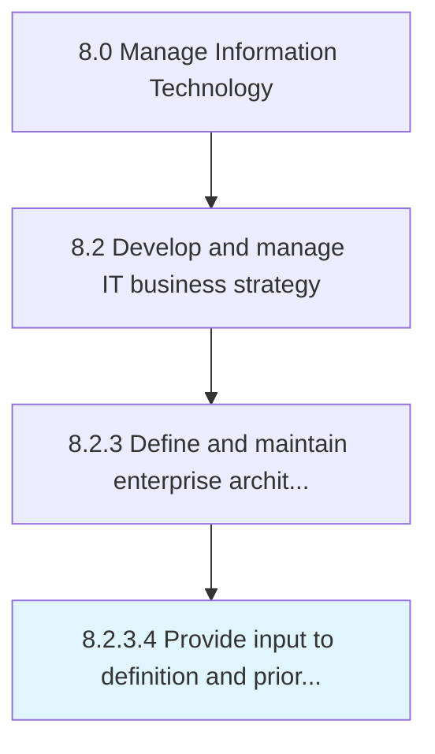

# Provide input to definition and prioritization of IT projects

> Analyze the value driven through IT projects and redefine and/or reprioritize.

## Overview

Activity 8.2.3.4 is an activity within the Manage Information Technology framework. 

Analyze the value driven through IT projects and redefine and/or reprioritize. Evaluate planning, organizing, and implementation of IT projects based on research outcomes and business objectives.

## Process Hierarchy



## Key Statistics

| Metric | Value |
|--------|-------|
| APQC Code | 20673 |
| Hierarchy ID | 8.2.3.4 |
| Level | Activity |
| Parent | [8.2.3](../) |
| Sub-Processes | 0 |


## GraphDL Semantic Structure

```
provide.Input.to.DefinitionAndPrioritizationOfITProjects
```

| Component | Value | Description |
|-----------|-------|-------------|
| Verb | `provide` | Primary action |
| Object | `input` | Direct object |
| Preposition | `to` | Relationship |
| PrepObject | `definition and prioritization of IT projects` | Indirect object |


## Related Concepts

- Input
- DefinitionOfITProjects
- Input
- PrioritizationOfITProjects


---

*Source: APQC PCF 20673 (8.2.3.4) - APQC*
