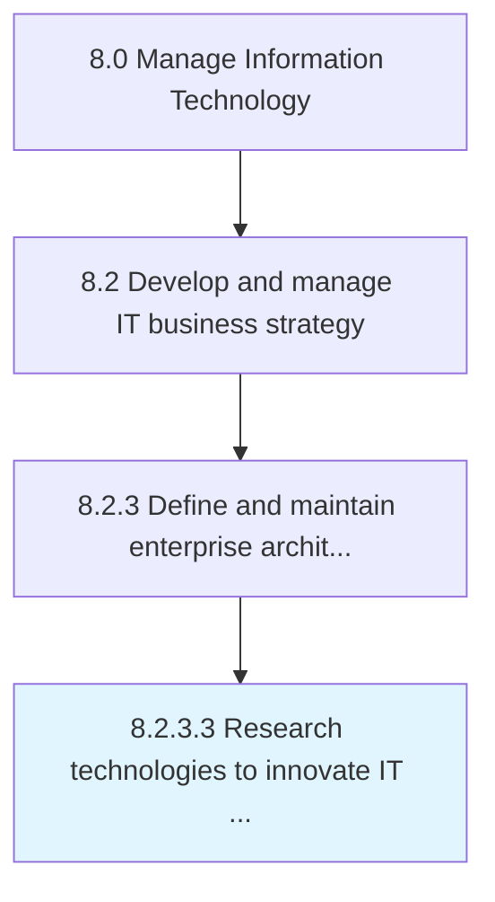

# Research technologies to innovate IT services and solutions

> Systematically investigating and studying materials and sources relevant to the IT function.

## Overview

Activity 8.2.3.3 is an activity within the Manage Information Technology framework. 

Systematically investigating and studying materials and sources relevant to the IT function. Reach meaningful insights and conclusions in the form of new ideas and innovation for delivering IT services and solutions.

## Process Hierarchy



## Key Statistics

| Metric | Value |
|--------|-------|
| APQC Code | 20672 |
| Hierarchy ID | 8.2.3.3 |
| Level | Activity |
| Parent | [8.2.3](../) |
| Sub-Processes | 0 |


## GraphDL Semantic Structure

```
research.Technologies.to.InnovateITServicesAndSolutions
```

| Component | Value | Description |
|-----------|-------|-------------|
| Verb | `research` | Primary action |
| Object | `technologies` | Direct object |
| Preposition | `to` | Relationship |
| PrepObject | `innovate IT services and solutions` | Indirect object |


## Related Concepts

- [Technologies](/concepts/Technologies)
- [InnovateITServices](/concepts/InnovateITServices)
- [Technologies](/concepts/Technologies)
- [Solutions](/concepts/Solutions)


---

*Source: APQC PCF 20672 (8.2.3.3) - APQC*
