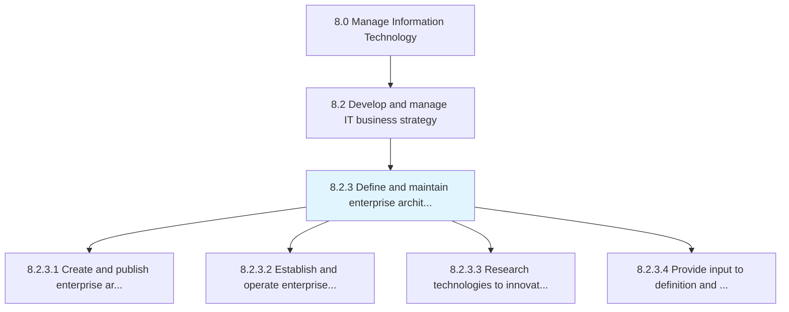
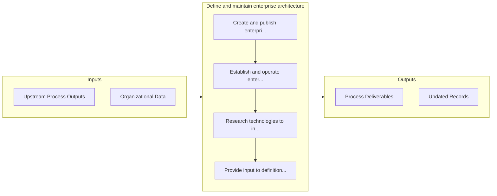

# Define and maintain enterprise architecture

> Outlining and maintaining the organization's IT architecture.

## Overview

Process 8.2.3 is a core process that defines the specific procedures for define and maintain enterprise architecture. 

Outlining and maintaining the organization's IT architecture. Establish the IT architecture definition and framework. Ensure the relevance of IT. Create and confirm the approach for IT maintenance. Create rules and regulations to guide IT architecture. Authenticate and finalize all IT related research and innovation that takes place within the organization.

## Process Hierarchy



## Key Statistics

| Metric | Value |
|--------|-------|
| APQC Code | 20668 |
| Hierarchy ID | 8.2.3 |
| Level | Process |
| Parent | [8.2](../) |
| Sub-Processes | 4 |


## GraphDL Semantic Structure

```graphdl
define.AndMaintainEnterpriseArchitecture
```

| Component | Value | Description |
|-----------|-------|-------------|
| Verb | `define` | Primary action |
| Object | `and maintain enterprise architecture` | Direct object |


## Process Flow



## Sub-Processes

| Process | Hierarchy ID | Description |
|---------|-------------|-------------|
| [Create and publish enterprise architecture principles](./CreateAndPublishEnterpriseArchitecturePrinciples) | 8.2.3.1 | Creating and publishing high level statements of the fundamental values (principles) based on the or |
| [Establish and operate enterprise architecture governance](./EstablishAndOperateEnterpriseArchitectureGovernance) | 8.2.3.2 | Establishing and operating a structure by which an enterprise defines appropriate strategies and ens |
| [Research technologies to innovate IT services and solutions](./ResearchTechnologiesToInnovateITServicesAndSolutions) | 8.2.3.3 | Systematically investigating and studying materials and sources relevant to the IT function |
| [Provide input to definition and prioritization of IT projects](./ProvideInputToDefinitionAndPrioritizationOfITProjects) | 8.2.3.4 | Analyze the value driven through IT projects and redefine and/or reprioritize |


## Related Concepts

- EnterpriseArchitecture
- EnterpriseArchitecture


---

*Source: APQC PCF 20668 (8.2.3) - APQC*
