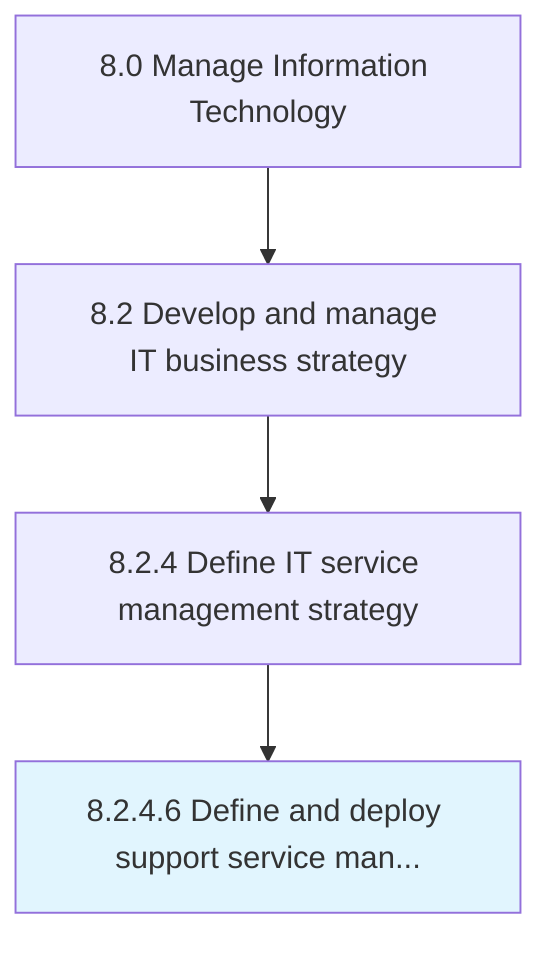

# Define and deploy support service management process tools and methods

> Establishing services for providing support to users of IT services and solutions.

## Overview

Activity 8.2.4.6 is an activity within the Manage Information Technology framework. 

Establishing services for providing support to users of IT services and solutions. Define the plethora of services along with tools and methods by which the organization assists users of computers, software products, or other electronic/mechanical products.

## Process Hierarchy



## Key Statistics

| Metric | Value |
|--------|-------|
| APQC Code | 20680 |
| Hierarchy ID | 8.2.4.6 |
| Level | Activity |
| Parent | [8.2.4](../) |
| Sub-Processes | 0 |


## GraphDL Semantic Structure

```
define.AndDeploySupportServiceManagementProcessToolsAndMethods
```

| Component | Value | Description |
|-----------|-------|-------------|
| Verb | `define` | Primary action |
| Object | `and deploy support service management process tools and methods` | Direct object |


## Related Concepts

- [SupportServiceManagementProcessTools](/concepts/SupportServiceManagementProcessTools)
- [Methods](/concepts/Methods)
- [SupportServiceManagementProcessTools](/concepts/SupportServiceManagementProcessTools)
- [Methods](/concepts/Methods)


---

*Source: APQC PCF 20680 (8.2.4.6) - APQC*
