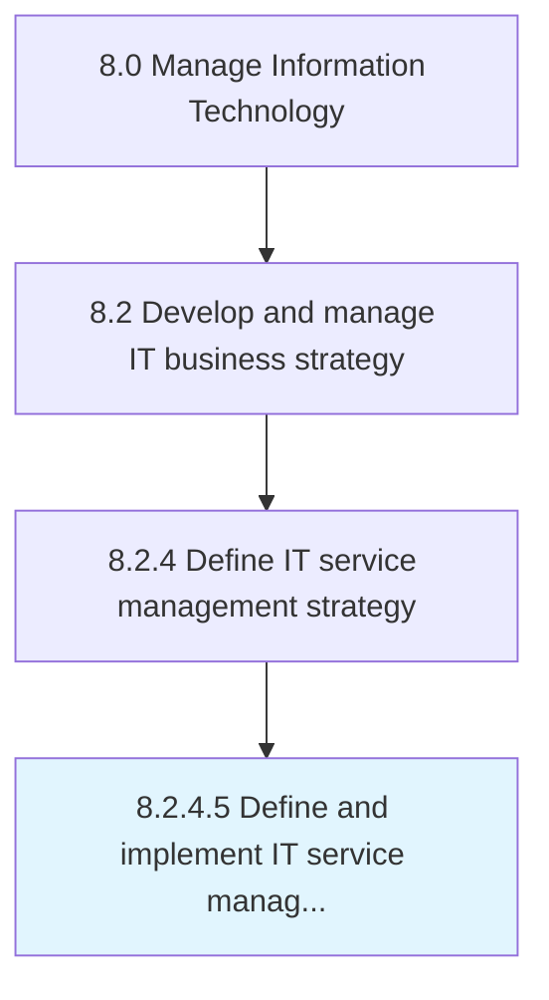

# Define and implement IT service management

> Defining and implementing activities involved in designing, creating, delivering, supporting, and managing the lifecycle of information technology services within an organization.

## Overview

Activity 8.2.4.5 is an activity within the Manage Information Technology framework. 

Defining and implementing activities involved in designing, creating, delivering, supporting, and managing the lifecycle of information technology services within an organization.

## Process Hierarchy



## Key Statistics

| Metric | Value |
|--------|-------|
| APQC Code | 20679 |
| Hierarchy ID | 8.2.4.5 |
| Level | Activity |
| Parent | [8.2.4](../) |
| Sub-Processes | 0 |


## GraphDL Semantic Structure

```
define.AndImplementITServiceManagement
```

| Component | Value | Description |
|-----------|-------|-------------|
| Verb | `define` | Primary action |
| Object | `and implement IT service management` | Direct object |


## Related Concepts

- [ITServiceManagement](/concepts/ITServiceManagement)
- [ITServiceManagement](/concepts/ITServiceManagement)


---

*Source: APQC PCF 20679 (8.2.4.5) - APQC*
