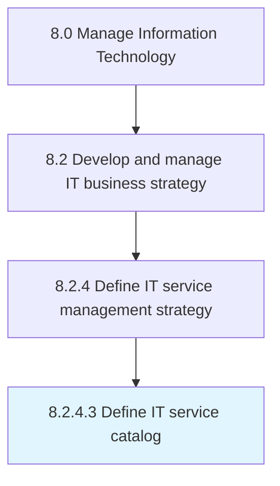

# Define IT service catalog

> Create and design an organized and curated collection of all IT-related services that can be performed by, for, or within the organization.

## Overview

Activity 8.2.4.3 is an activity within the Manage Information Technology framework. 

Create and design an organized and curated collection of all IT-related services that can be performed by, for, or within the organization.

## Process Hierarchy



## Key Statistics

| Metric | Value |
|--------|-------|
| APQC Code | 20677 |
| Hierarchy ID | 8.2.4.3 |
| Level | Activity |
| Parent | [8.2.4](../) |
| Sub-Processes | 0 |


## GraphDL Semantic Structure

```
define.ITServiceCatalog
```

| Component | Value | Description |
|-----------|-------|-------------|
| Verb | `define` | Primary action |
| Object | `IT service catalog` | Direct object |


## Related Concepts

- [ITServiceCatalog](/concepts/ITServiceCatalog)


---

*Source: APQC PCF 20677 (8.2.4.3) - APQC*
