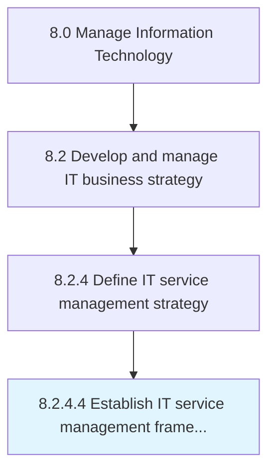

# Establish IT service management framework

> Create a layered structure for IT service management framework ensuring right processes, people, and technology are in place to meet business goals.

## Overview

Activity 8.2.4.4 is an activity within the Manage Information Technology framework. 

Create a layered structure for IT service management framework ensuring right processes, people, and technology are in place to meet business goals.

## Process Hierarchy



## Key Statistics

| Metric | Value |
|--------|-------|
| APQC Code | 20678 |
| Hierarchy ID | 8.2.4.4 |
| Level | Activity |
| Parent | [8.2.4](../) |
| Sub-Processes | 0 |


## GraphDL Semantic Structure

```
establish.ITServiceManagementFramework
```

| Component | Value | Description |
|-----------|-------|-------------|
| Verb | `establish` | Primary action |
| Object | `IT service management framework` | Direct object |


## Related Concepts

- [ITServiceManagementFramework](/concepts/ITServiceManagementFramework)


---

*Source: APQC PCF 20678 (8.2.4.4) - APQC*
