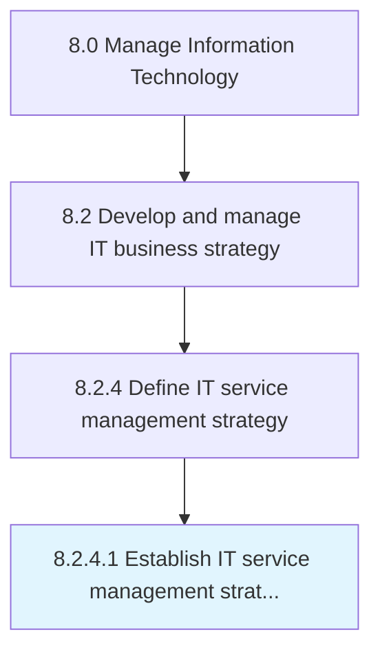

# Establish IT service management strategy and goals

> Implementing strategy for designing, delivering, managing, and improving the way information technology be used in the organization.

## Overview

Activity 8.2.4.1 is an activity within the Manage Information Technology framework. 

Implementing strategy for designing, delivering, managing, and improving the way information technology be used in the organization. The goal of IT Service Management is to ensure that the right processes, people, and technology are in place to meet business goals.

## Process Hierarchy



## Key Statistics

| Metric | Value |
|--------|-------|
| APQC Code | 20675 |
| Hierarchy ID | 8.2.4.1 |
| Level | Activity |
| Parent | [8.2.4](../) |
| Sub-Processes | 0 |


## GraphDL Semantic Structure

```
establish.ITServiceManagementStrategyAndGoals
```

| Component | Value | Description |
|-----------|-------|-------------|
| Verb | `establish` | Primary action |
| Object | `IT service management strategy and goals` | Direct object |


## Related Concepts

- ITServiceManagementStrategy
- Goals


---

*Source: APQC PCF 20675 (8.2.4.1) - APQC*
