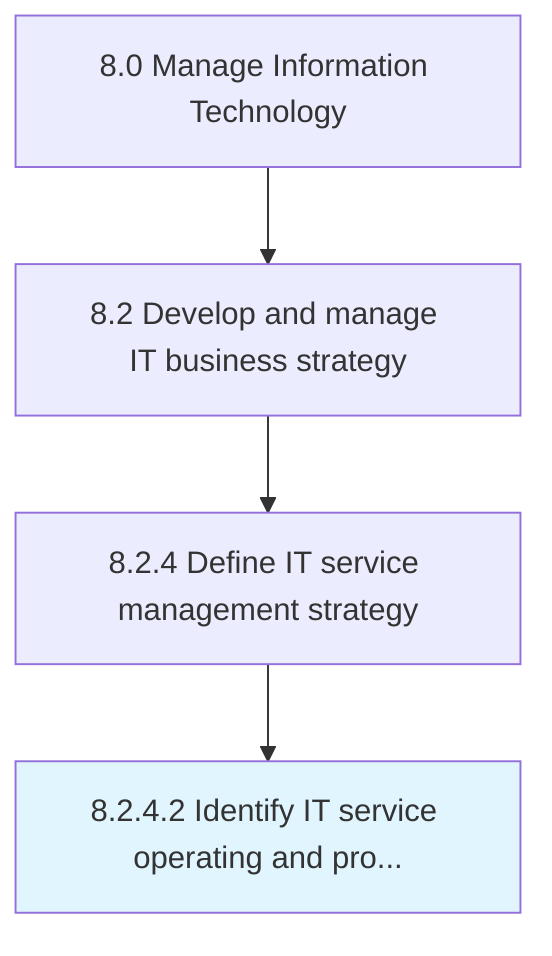

# Identify IT service operating and process requirements

> Identifying operating and process requirement for designing, delivering, managing, and improving the way information technology be used in the organization.

## Overview

Activity 8.2.4.2 is an activity within the Manage Information Technology framework. 

Identifying operating and process requirement for designing, delivering, managing, and improving the way information technology be used in the organization.

## Process Hierarchy



## Key Statistics

| Metric | Value |
|--------|-------|
| APQC Code | 20676 |
| Hierarchy ID | 8.2.4.2 |
| Level | Activity |
| Parent | [8.2.4](../) |
| Sub-Processes | 0 |


## GraphDL Semantic Structure

```
identify.ITServiceOperatingAndProcessRequirements
```

| Component | Value | Description |
|-----------|-------|-------------|
| Verb | `identify` | Primary action |
| Object | `IT service operating and process requirements` | Direct object |


## Related Concepts

- ITServiceOperating
- ProcessRequirements


---

*Source: APQC PCF 20676 (8.2.4.2) - APQC*
