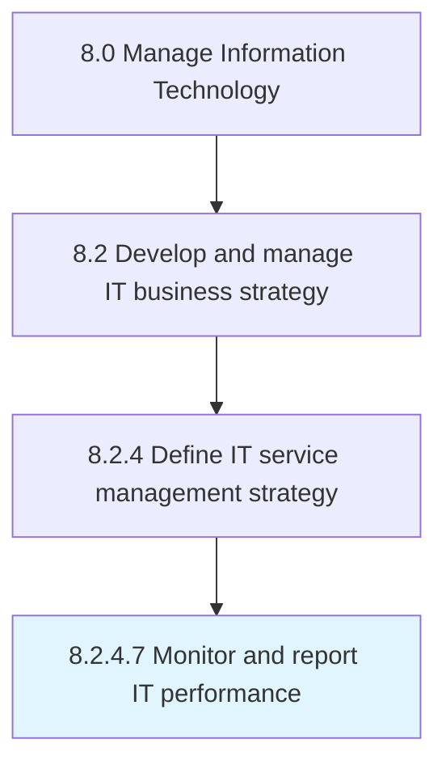

# Monitor and report IT performance

> Supervising, analyzing, and reporting performance of information technology to ensure they are on-course and on-schedule in meeting the organizational objectives and performance targets.

## Overview

Activity 8.2.4.7 is an activity within the Manage Information Technology framework. 

Supervising, analyzing, and reporting performance of information technology to ensure they are on-course and on-schedule in meeting the organizational objectives and performance targets.

## Process Hierarchy



## Key Statistics

| Metric | Value |
|--------|-------|
| APQC Code | 20681 |
| Hierarchy ID | 8.2.4.7 |
| Level | Activity |
| Parent | [8.2.4](../) |
| Sub-Processes | 0 |


## GraphDL Semantic Structure

```
monitor.AndReportITPerformance
```

| Component | Value | Description |
|-----------|-------|-------------|
| Verb | `monitor` | Primary action |
| Object | `and report IT performance` | Direct object |


## Related Concepts

- [ITPerformance](/concepts/ITPerformance)
- [ITPerformance](/concepts/ITPerformance)


---

*Source: APQC PCF 20681 (8.2.4.7) - APQC*
