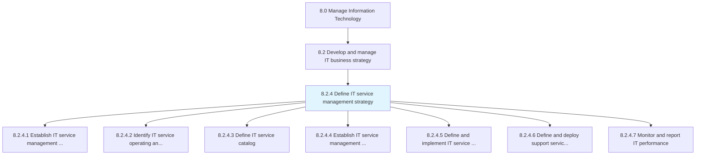
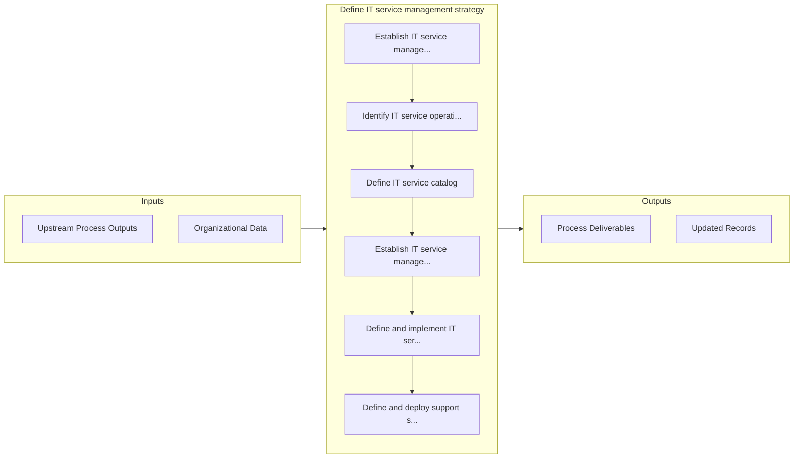

# Define IT service management strategy

> Defining perspective, position, plans, and patterns needed to execute designing, delivering, managing, and improving the way information technology is used within an organization.

## Overview

Process 8.2.4 is a core process that defines the specific procedures for define it service management strategy. 

Defining perspective, position, plans, and patterns needed to execute designing, delivering, managing, and improving the way information technology is used within an organization.

## Process Hierarchy



## Key Statistics

| Metric | Value |
|--------|-------|
| APQC Code | 20674 |
| Hierarchy ID | 8.2.4 |
| Level | Process |
| Parent | [8.2](../) |
| Sub-Processes | 7 |


## GraphDL Semantic Structure

```graphdl
define.ITServiceManagementStrategy
```

| Component | Value | Description |
|-----------|-------|-------------|
| Verb | `define` | Primary action |
| Object | `IT service management strategy` | Direct object |


## Process Flow



## Sub-Processes

| Process | Hierarchy ID | Description |
|---------|-------------|-------------|
| [Establish IT service management strategy and goals](./EstablishITServiceManagementStrategyAndGoals) | 8.2.4.1 | Implementing strategy for designing, delivering, managing, and improving the way information technol |
| [Identify IT service operating and process requirements](./IdentifyITServiceOperatingAndProcessRequirements) | 8.2.4.2 | Identifying operating and process requirement for designing, delivering, managing, and improving the |
| [Define IT service catalog](./DefineITServiceCatalog) | 8.2.4.3 | Create and design an organized and curated collection of all IT-related services that can be perform |
| [Establish IT service management framework](./EstablishITServiceManagementFramework) | 8.2.4.4 | Create a layered structure for IT service management framework ensuring right processes, people, and |
| [Define and implement IT service management](./DefineAndImplementITServiceManagement) | 8.2.4.5 | Defining and implementing activities involved in designing, creating, delivering, supporting, and ma |
| [Define and deploy support service management process tools and methods](./DefineAndDeploySupportServiceManagementProcessToolsAndMethods) | 8.2.4.6 | Establishing services for providing support to users of IT services and solutions |
| [Monitor and report IT performance](./MonitorAndReportITPerformance) | 8.2.4.7 | Supervising, analyzing, and reporting performance of information technology to ensure they are on-co |


## Related Concepts

- ITServiceManagementStrategy


---

*Source: APQC PCF 20674 (8.2.4) - APQC*
