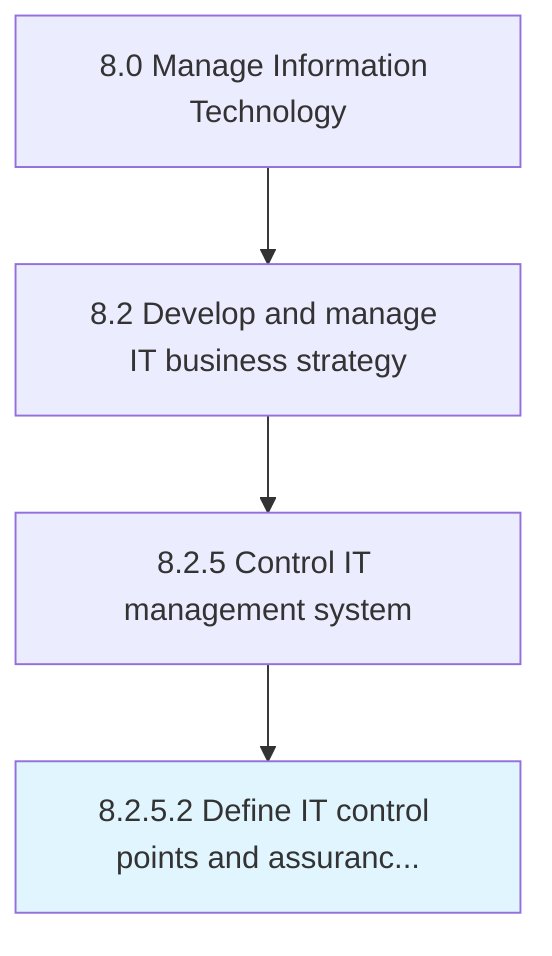

# Define IT control points and assurance procedures governance model

> Establishing a governance model with its own structure and functions from where full or partial control can be exercised over the entire IT management system.

## Overview

Activity 8.2.5.2 is an activity within the Manage Information Technology framework. 

Establishing a governance model with its own structure and functions from where full or partial control can be exercised over the entire IT management system. Specify evaluation and quality control procedures in the structure.

## Process Hierarchy



## Key Statistics

| Metric | Value |
|--------|-------|
| APQC Code | 20684 |
| Hierarchy ID | 8.2.5.2 |
| Level | Activity |
| Parent | [8.2.5](../) |
| Sub-Processes | 0 |


## GraphDL Semantic Structure

```
define.ITControlPointsAndAssuranceProceduresGovernanceModel
```

| Component | Value | Description |
|-----------|-------|-------------|
| Verb | `define` | Primary action |
| Object | `IT control points and assurance procedures governance model` | Direct object |


## Related Concepts

- ITControlPointsProceduresGovernanceModel
- AssuranceProceduresGovernanceModel


---

*Source: APQC PCF 20684 (8.2.5.2) - APQC*
