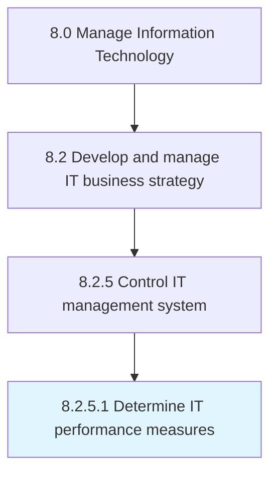

# Determine IT performance measures

> Determining measures for evaluating the performance of IT services in the organization.

## Overview

Activity 8.2.5.1 is an activity within the Manage Information Technology framework. 

Determining measures for evaluating the performance of IT services in the organization. Establish key performance indicators, including the IT services performance index.

## Process Hierarchy



## Key Statistics

| Metric | Value |
|--------|-------|
| APQC Code | 20683 |
| Hierarchy ID | 8.2.5.1 |
| Level | Activity |
| Parent | [8.2.5](../) |
| Sub-Processes | 0 |


## GraphDL Semantic Structure

```
determine.ITPerformanceMeasures
```

| Component | Value | Description |
|-----------|-------|-------------|
| Verb | `determine` | Primary action |
| Object | `IT performance measures` | Direct object |


## Related Concepts

- ITPerformanceMeasures


---

*Source: APQC PCF 20683 (8.2.5.1) - APQC*
