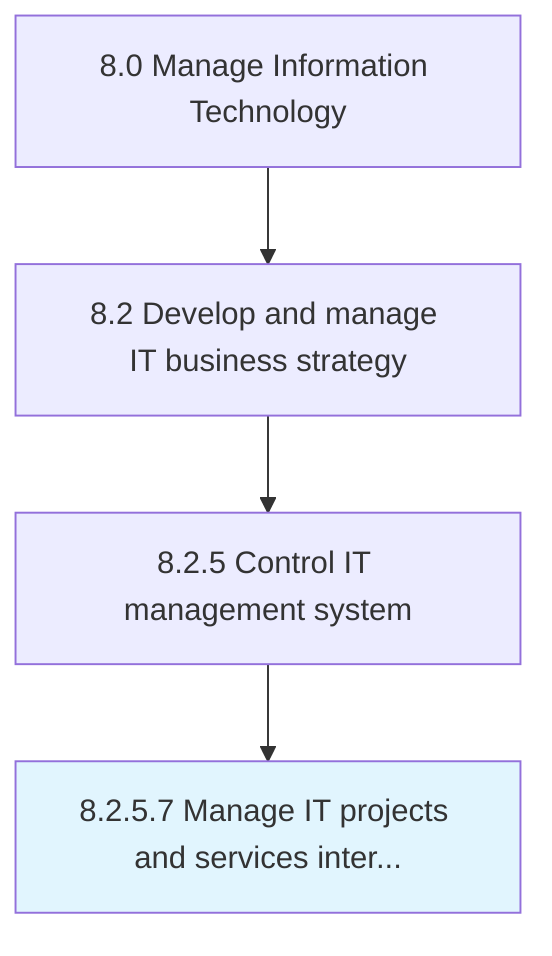

# Manage IT projects and services interdependencies

> Manage capabilities required for the successful delivery of information technology projects, which, by extension, affect the success of the overall IT services.

## Overview

Activity 8.2.5.7 is an activity within the Manage Information Technology framework. 

Manage capabilities required for the successful delivery of information technology projects, which, by extension, affect the success of the overall IT services.

## Process Hierarchy



## Key Statistics

| Metric | Value |
|--------|-------|
| APQC Code | 20689 |
| Hierarchy ID | 8.2.5.7 |
| Level | Activity |
| Parent | [8.2.5](../) |
| Sub-Processes | 0 |


## GraphDL Semantic Structure

```
manage.ITProjectsAndServicesInterdependencies
```

| Component | Value | Description |
|-----------|-------|-------------|
| Verb | `manage` | Primary action |
| Object | `IT projects and services interdependencies` | Direct object |


## Related Concepts

- [ITProjects](/concepts/ITProjects)
- [ServicesInterdependencies](/concepts/ServicesInterdependencies)


---

*Source: APQC PCF 20689 (8.2.5.7) - APQC*
