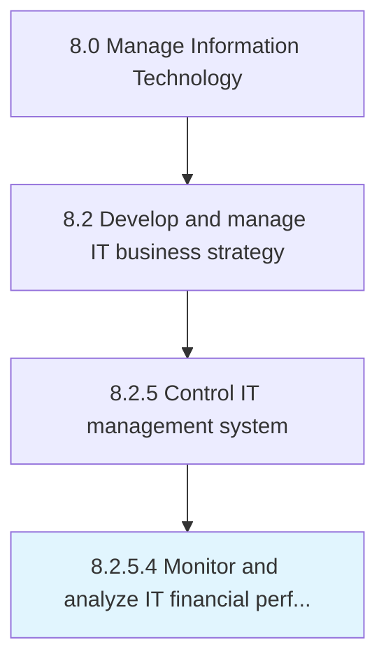

# Monitor and analyze IT financial performance

> Checking and analyzing predetermined financial targets and timelines of IT management system.

## Overview

Activity 8.2.5.4 is an activity within the Manage Information Technology framework. 

Checking and analyzing predetermined financial targets and timelines of IT management system. Monitoring their profitability, feasibility, and consistency. Study the revenues generated.

## Process Hierarchy



## Key Statistics

| Metric | Value |
|--------|-------|
| APQC Code | 20686 |
| Hierarchy ID | 8.2.5.4 |
| Level | Activity |
| Parent | [8.2.5](../) |
| Sub-Processes | 0 |


## GraphDL Semantic Structure

```
monitor.AndAnalyzeITFinancialPerformance
```

| Component | Value | Description |
|-----------|-------|-------------|
| Verb | `monitor` | Primary action |
| Object | `and analyze IT financial performance` | Direct object |


## Related Concepts

- ITFinancialPerformance
- ITFinancialPerformance


---

*Source: APQC PCF 20686 (8.2.5.4) - APQC*
