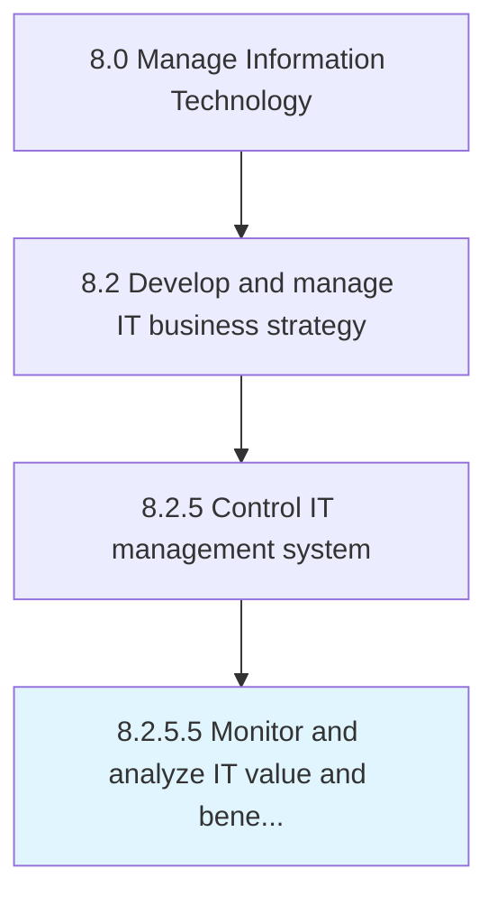

# Monitor and analyze IT value and benefits

> Examining and analyzing the value and benefits of IT service management to ensure benefits outweigh incurred costs.

## Overview

Activity 8.2.5.5 is an activity within the Manage Information Technology framework. 

Examining and analyzing the value and benefits of IT service management to ensure benefits outweigh incurred costs.

## Process Hierarchy



## Key Statistics

| Metric | Value |
|--------|-------|
| APQC Code | 20687 |
| Hierarchy ID | 8.2.5.5 |
| Level | Activity |
| Parent | [8.2.5](../) |
| Sub-Processes | 0 |


## GraphDL Semantic Structure

```
monitor.AndAnalyzeITValueAndBenefits
```

| Component | Value | Description |
|-----------|-------|-------------|
| Verb | `monitor` | Primary action |
| Object | `and analyze IT value and benefits` | Direct object |


## Related Concepts

- [ITValue](/concepts/ITValue)
- [Benefits](/concepts/Benefits)
- [ITValue](/concepts/ITValue)
- [Benefits](/concepts/Benefits)


---

*Source: APQC PCF 20687 (8.2.5.5) - APQC*
