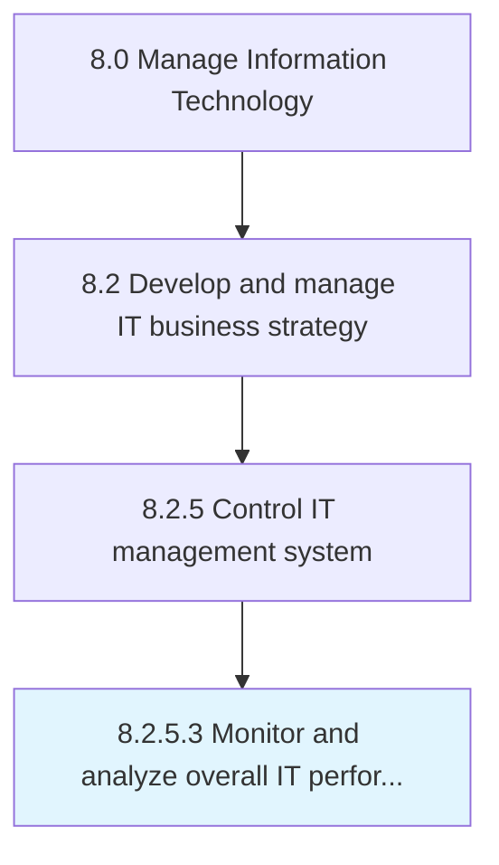

# Monitor and analyze overall IT performance

> Monitoring and analyzing information technology performance measures to ensure timely completion, and that quality assurance is met at all steps of IT services.

## Overview

Activity 8.2.5.3 is an activity within the Manage Information Technology framework. 

Monitoring and analyzing information technology performance measures to ensure timely completion, and that quality assurance is met at all steps of IT services.

## Process Hierarchy



## Key Statistics

| Metric | Value |
|--------|-------|
| APQC Code | 20685 |
| Hierarchy ID | 8.2.5.3 |
| Level | Activity |
| Parent | [8.2.5](../) |
| Sub-Processes | 0 |


## GraphDL Semantic Structure

```
monitor.AndAnalyzeOverallITPerformance
```

| Component | Value | Description |
|-----------|-------|-------------|
| Verb | `monitor` | Primary action |
| Object | `and analyze overall IT performance` | Direct object |


## Related Concepts

- OverallITPerformance
- OverallITPerformance


---

*Source: APQC PCF 20685 (8.2.5.3) - APQC*
