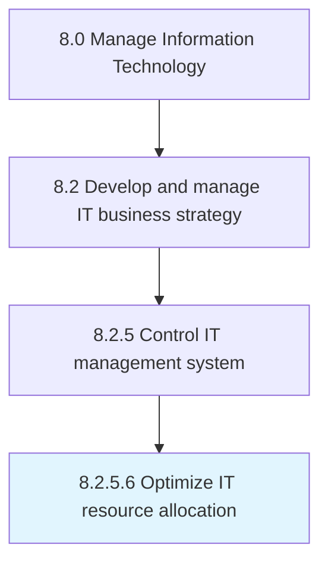

# Optimize IT resource allocation

> Create process to assign and manage IT assets that support organization's strategic goals.

## Overview

Activity 8.2.5.6 is an activity within the Manage Information Technology framework. 

Create process to assign and manage IT assets that support organization's strategic goals.

## Process Hierarchy



## Key Statistics

| Metric | Value |
|--------|-------|
| APQC Code | 20688 |
| Hierarchy ID | 8.2.5.6 |
| Level | Activity |
| Parent | [8.2.5](../) |
| Sub-Processes | 0 |


## GraphDL Semantic Structure

```
optimize.ITResourceAllocation
```

| Component | Value | Description |
|-----------|-------|-------------|
| Verb | `optimize` | Primary action |
| Object | `IT resource allocation` | Direct object |


## Related Concepts

- [ITResourceAllocation](/concepts/ITResourceAllocation)


---

*Source: APQC PCF 20688 (8.2.5.6) - APQC*
