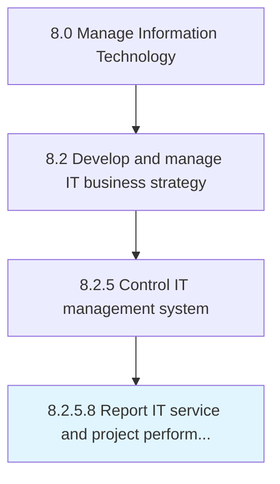

# Report IT service and project performance

> Process of collecting, analyzing, and reporting information regarding the performance of IT services and projects.

## Overview

Activity 8.2.5.8 is an activity within the Manage Information Technology framework. 

Process of collecting, analyzing, and reporting information regarding the performance of IT services and projects.

## Process Hierarchy



## Key Statistics

| Metric | Value |
|--------|-------|
| APQC Code | 20690 |
| Hierarchy ID | 8.2.5.8 |
| Level | Activity |
| Parent | [8.2.5](../) |
| Sub-Processes | 0 |


## GraphDL Semantic Structure

```
report.ITServiceAndProjectPerformance
```

| Component | Value | Description |
|-----------|-------|-------------|
| Verb | `report` | Primary action |
| Object | `IT service and project performance` | Direct object |


## Related Concepts

- ITService
- ProjectPerformance


---

*Source: APQC PCF 20690 (8.2.5.8) - APQC*
