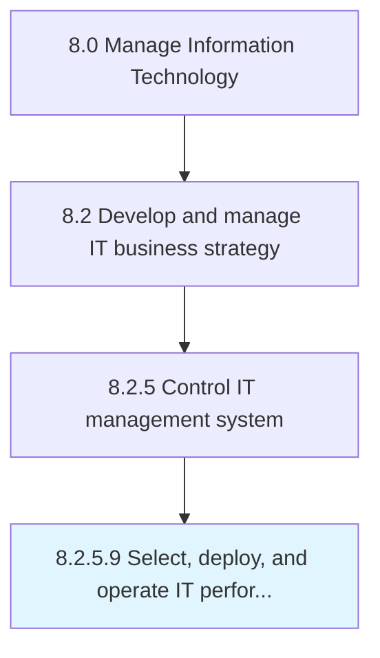

# Select, deploy, and operate IT performance analytics tools

> Select, establish, and operate analytics tool to analyze data and extract actionable and commercially relevant information on IT performance to evaluate or increase performance.

## Overview

Activity 8.2.5.9 is an activity within the Manage Information Technology framework. 

Select, establish, and operate analytics tool to analyze data and extract actionable and commercially relevant information on IT performance to evaluate or increase performance.

## Process Hierarchy



## Key Statistics

| Metric | Value |
|--------|-------|
| APQC Code | 20692 |
| Hierarchy ID | 8.2.5.9 |
| Level | Activity |
| Parent | [8.2.5](../) |
| Sub-Processes | 0 |


## GraphDL Semantic Structure

```
select,.DeployAndOperateITPerformanceAnalyticsTools
```

| Component | Value | Description |
|-----------|-------|-------------|
| Verb | `select,` | Primary action |
| Object | `deploy, and operate IT performance analytics tools` | Direct object |


## Related Concepts

- ITPerformanceAnalyticsTools
- ITPerformanceAnalyticsTools
- ITPerformanceAnalyticsTools


---

*Source: APQC PCF 20692 (8.2.5.9) - APQC*
