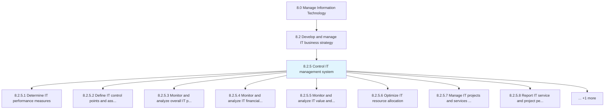
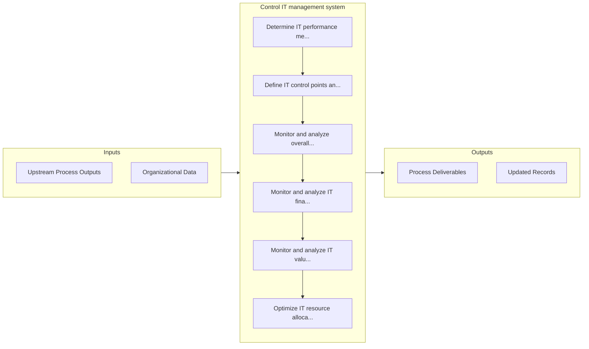

# Control IT management system

> Regulating the IT management system through performance measures, governance, analysis, and monitoring through a variety of analytic tools.

## Overview

Process 8.2.5 is a core process that defines the specific procedures for control it management system. 

Regulating the IT management system through performance measures, governance, analysis, and monitoring through a variety of analytic tools. Evaluate IT finances, resource, services, projects, and value for report out.

## Process Hierarchy



## Key Statistics

| Metric | Value |
|--------|-------|
| APQC Code | 20682 |
| Hierarchy ID | 8.2.5 |
| Level | Process |
| Parent | [8.2](../) |
| Sub-Processes | 9 |


## GraphDL Semantic Structure

```
control.ITManagementSystem
```

| Component | Value | Description |
|-----------|-------|-------------|
| Verb | `control` | Primary action |
| Object | `IT management system` | Direct object |


## Process Flow



## Sub-Processes

| Process | Hierarchy ID | Description |
|---------|-------------|-------------|
| [Determine IT performance measures](./DetermineITPerformanceMeasures) | 8.2.5.1 | Determining measures for evaluating the performance of IT services in the organization |
| [Define IT control points and assurance procedures governance model](./DefineITControlPointsAndAssuranceProceduresGovernanceModel) | 8.2.5.2 | Establishing a governance model with its own structure and functions from where full or partial cont |
| [Monitor and analyze overall IT performance](./MonitorAndAnalyzeOverallITPerformance) | 8.2.5.3 | Monitoring and analyzing information technology performance measures to ensure timely completion, an |
| [Monitor and analyze IT financial performance](./MonitorAndAnalyzeITFinancialPerformance) | 8.2.5.4 | Checking and analyzing predetermined financial targets and timelines of IT management system |
| [Monitor and analyze IT value and benefits](./MonitorAndAnalyzeITValueAndBenefits) | 8.2.5.5 | Examining and analyzing the value and benefits of IT service management to ensure benefits outweigh  |
| [Optimize IT resource allocation](./OptimizeITResourceAllocation) | 8.2.5.6 | Create process to assign and manage IT assets that support organization's strategic goals |
| [Manage IT projects and services interdependencies](./ManageITProjectsAndServicesInterdependencies) | 8.2.5.7 | Manage capabilities required for the successful delivery of information technology projects, which,  |
| [Report IT service and project performance](./ReportITServiceAndProjectPerformance) | 8.2.5.8 | Process of collecting, analyzing, and reporting information regarding the performance of IT services |
| [Select, deploy, and operate IT performance analytics tools](./SelectDeployAndOperateITPerformanceAnalyticsTools) | 8.2.5.9 | Select, establish, and operate analytics tool to analyze data and extract actionable and commerciall |


## Related Concepts

- ITManagementSystem


---

*Source: APQC PCF 20682 (8.2.5) - APQC*
